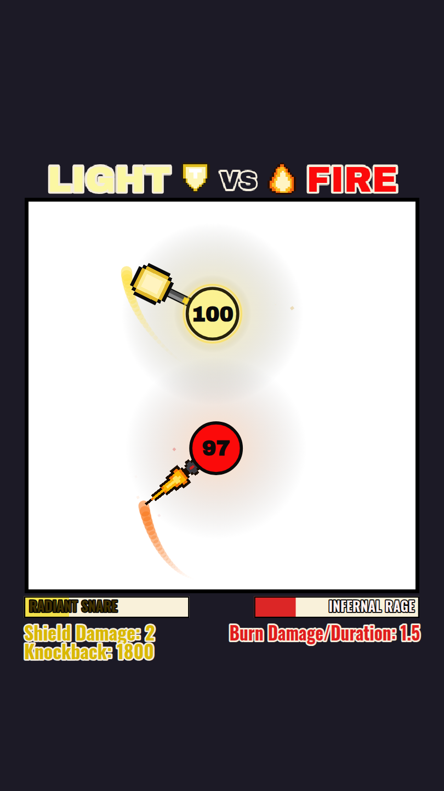

# Elemental Duel — cinq combattants, trois formats

Duels **à deux, en 2 contre 2 ou en bataille royale** (jusqu'à cinq, chacun pour
soi), avec des combattants repris de la chaîne **« ballthingsim »**, en
**HTML + CSS + JavaScript** avec un rendu **Canvas 2D**. Aucune dépendance,
aucun build : le dépôt se publie tel quel sur GitHub Pages.

Chaque combattant est relevé image par image sur sa vidéo — couleurs à la
pipette, portées au pixel, cadences chronométrées. Ce qui n'a pas pu être
mesuré est calé au banc d'essai, et le dit.

| Personnage | Arme | Signature | Ultime |
| --- | --- | --- | --- |
| **Calamity** | Pacificateur | **canon asservi à la cible** — il ne tourne pas ; barillet de 6, balles qui gèlent, et **un tour du pistolet sur lui-même** au rechargement | Grêle de plomb / HAILFIRE (cadence doublée, recul ×8) |
| **Cinder** | Lame de braise (transcrite d'une maquette) | rotation qui monte de 0,80 à 3,00 tour/s puis **surchauffe** ; `Damage = 2 × Spin` | Fauche ardente / EMBER SWEEP (verrou de touche à 115 ms, éventail vert grand ouvert) |
| **Tempest** | Croc d'orage (**164 px, la plus longue portée du jeu**) — **elle suit son cap de déplacement**, elle ne vise pas | **charge** en ligne droite à 2,6 × sa vitesse, pointe en avant, en semant des images fantômes ; dégâts qui montent de **+2 par touche portée** | Foudre tombante / THUNDERFALL — il **quitte l'arène** 1,5 s, un marqueur suit sa cible, puis il retombe dessus |
| **Shinobi** | Shuriken d'ombre — **la bille *est* l'arme**, sprite centré dessus | hitbox en **disque** de 75 px tout autour, le seul du roster ; palette sombre | Tornade de shurikens / SHURIKEN TORNADO |
| **Briar** | Bâton de ronce (transcrit d'une maquette) — **braqué sur la cible, centré sur son pivot et dessiné par-dessus la bille** | **tireur** : des **orbes guidées** qui virent vers l'adversaire, à une **cadence qui monte toute seule** (+0,05 par orbe, de 1,00 à 4,00 par seconde) | Ronceraie / BRIARSTORM |

### Trois formats

| Format | Ce que c'est |
| --- | --- |
| **Duel** | un contre un, le format d'origine — c'est lui, et lui seul, dont l'équilibrage est relevé |
| **2 contre 2** | deux équipes de deux. Les armes ne touchent que le camp adverse, mais les **corps se bousculent entre tous** : un coéquipier reste un obstacle |
| **Bataille royale** | 3 à 5 combattants, chacun pour soi, dernier debout |

Le moteur ne connaît aucun de ces trois noms : il reçoit une liste de
combattants et **un camp pour chacun**. « 2 contre 2 » et « chacun pour soi »
sont deux façons de remplir la même liste de camps. Ajouter un format ne demande
donc pas une ligne de moteur.

Au-delà de deux combattants, chacun vise l'**ennemi vivant le plus proche** et
peut changer de cible d'un pas à l'autre, un **mort quitte le terrain
immédiatement**, et l'écran de fin affiche un classement.

Le HUD se sépare alors en deux bandeaux : les **points de vie en haut** de
l'écran, une plaque par combattant, et en bas ce que le duel y met déjà — jauge
d'ultime, jauge de pouvoir spécial et ligne de stat, pour chacun. Les deux
bandeaux gardent le même ordre, donc un combattant est à la même place dans les
deux.

Chaque combat s'ouvre par **une seconde d'attente, combattants immobiles** :
l'arène s'éclaircit, les armes tournent, mais personne n'avance.

### Points de vie réglables

Chaque emplacement porte un champ **PV**, à 100 par défaut — la valeur du cahier
des charges — et réglable de 1 à 999. C'est le moyen le plus direct de corriger
un déséquilibre ou de poser un handicap sans toucher à une fiche : Cinder à
150 PV contre Tempest à 100, par exemple. Tout ce qui affiche une proportion
de vie (barre du HUD, cerclage rouge sous un quart de vie) suit la valeur du
combattant, pas une constante.

La matrice d'équilibrage, elle, joue toujours à 100 : c'est ce qui en fait un
garde-fou stable.

Chacun porte en plus un **pouvoir spécial**, sur horloge propre, avec sa jauge
juste sous celle de l'ultime. Il s'ajoute à l'ultime, il ne le remplace pas —
voir [`docs/FICHES.md`](docs/FICHES.md).

| | Pouvoir spécial |
| --- | --- |
| **Calamity** | **Vent de tombe** — champ de givre qui le suit, ralentit et grignote |
| **Cinder** | **Rage infernale** — braises, aura brûlante |
| **Tempest** | **Lien d'essence** — dôme figé + rayon qui draine |
| **Shinobi** | **Clone d'ombre** — des doubles permanents qui héritent de ses PV restants, se déplacent, bousculent et frappent avec son arme, sans aucun de ses pouvoirs, d'un ton plus clair que lui |
| **Briar** | **Tir enraciné** — des racines le clouent au sol une seconde, il cesse de bouger *et* de tirer, puis lâche une **orbe majeure** à trois fois les dégâts |

<sup>[Le Vent de tombe de Calamity](docs/capture-blizzard.png) · [le Lien d'essence de Tempest](docs/capture-lien.png) · [le Clone d'ombre du Shinobi](docs/capture-clone.png) · [les orbes guidées de Briar](docs/capture-mage.png) · [sa Ronceraie](docs/capture-mage-tempete.png) · [son Tir enraciné](docs/capture-mage-enracine.png).</sup>



<sup>Les nouveaux formats : [un 2 contre 2](docs/capture-2v2.png) (les camps groupés dans le titre et dans le HUD) · [une bataille royale à cinq](docs/capture-royale.png) · [la parade à deux vainqueurs](docs/capture-fin-2v2.png).</sup>

<sup>Tempest (charge, Lien d'essence) contre Cinder (surchauffe, Rage infernale). Voir aussi [l'écran de sélection](docs/capture-selection.png), [Calamity sous HAILFIRE](docs/capture-horsloi.png), [la ruée de Cinder](docs/capture-bretteur.png), [la Foudre tombante de Tempest](docs/capture-lancer.png), [sa charge de lance](docs/capture-lancer-charge.png) et [l'écran de fin avec l'export Short](docs/capture-fin.png).</sup>

---

## Démarrer

```bash
# n'importe quel serveur statique (les modules ES nécessitent http://, pas file://)
python3 -m http.server 8080
# puis http://localhost:8080
```

### Publier sur GitHub Pages

Le dépôt est configuré en *Settings → Pages → Source = GitHub Actions* : chaque
push sur `main` déclenche `.github/workflows/pages.yml`, qui publie la racine
telle quelle (site en ligne : <https://sebistarrr.github.io/test2/>). Le workflow
se lance aussi à la main depuis l'onglet *Actions*.

Pour un déploiement « depuis une branche » plutôt que par Actions, choisis la
branche et le dossier `/ (root)` : le fichier `.nojekyll` (déjà présent)
empêche Jekyll d'ignorer les dossiers.

### Paramètres d'URL

| Paramètre    | Effet                                                             |
| ------------ | ----------------------------------------------------------------- |
| `?a=&b=`     | lance directement un duel sans écran de sélection — `outlaw`, `bladesman`, `lancer`, `wind` (le Shinobi), `mage` |
| `?f=`        | une liste de combattants, pour une partie à plusieurs : `?f=outlaw,mage,lancer,wind` |
| `?teams=`    | les camps, dans le même ordre que `?f=` : `0,0,1,1` fait un 2 contre 2. Omis, chacun pour soi |
| `?hp=`       | les points de vie de chacun, dans le même ordre : `?hp=250,100`. Omis ou invalide, 100 (bornes 1–999) |
| `?seed=1234` | rejoue **exactement** le même duel (déterminisme complet)          |
| `?lang=fr`   | **toute l'interface** en français — HUD, titre d'arène et écrans DOM (par défaut : l'anglais de la vidéo) |
| `?debug=1`   | hitboxes, vitesses, charge d'ultime, seed                          |
| `?rec=0`     | n'enregistre pas le duel : pas d'export possible, mais pas un cycle dépensé pour lui |

Exemple : `index.html?a=lancer&b=mage&seed=6&debug=1`

### À la fin d'un duel

| Action | Effet |
| --- | --- |
| **Revanche** | même affiche, **nouveau** tirage |
| **Revoir ce duel** | même affiche **et** même seed : la simulation étant déterministe, le duel se rejoue coup pour coup — vérifié automatiquement (mêmes touches, mêmes dégâts, même durée à la milliseconde) |
| **Exporter en Short** | télécharge la vidéo du duel qu'on vient de regarder, en **vertical 1080 × 1920**, prête à publier en YouTube Short |

La seed du duel est affichée sous le vainqueur : elle suffit à le refaire jouer
plus tard avec `?seed=`.

Chaque combattant a sa **signature à l'écran** (`look.flair`) : ruban de couleur
derrière la pointe de l'arme, nappe de sol à ses teintes, frémissement collé au
corps, gerbe d'impact et éclat d'incantation. S'y ajoutent les **nombres de
dégâts** qui s'envolent à chaque touche, les **ondes qui courent le long des
murs** à chaque rebond, le **sillage** derrière une boule projetée, la
**convergence de matière** dès 85 % de jauge d'ultime et le **cerclage rouge
pulsé** sous 25 PV.

Tout cela suit une règle de composition : **rien ne se pose entre le spectateur
et les combattants**. Ce qui remplit le cadre est au fond, sur les bords, ou
derrière la boule. Tout vit dans `src/render/flair.js`, avec son propre aléa :
la mise en scène ne peut pas déplacer une virgule de l'équilibrage.

La partie se termine par **deux secondes de parade** : les perdants quittent
l'arène, le ou les vainqueurs glissent au centre, grandissent, leur arme
s'emballe et ils poussent des anneaux à leur couleur — et **un bandeau les
nomme**. Un 2 contre 2 se gagne à deux, donc les deux paradent côte à côte.

C'est la dernière image de la vidéo exportée, et c'est pour elle que le bandeau
existe : le nom du gagnant n'apparaissait qu'à l'écran de résultat, qui n'est
pas filmé. La mise en place (glissement, agrandissement) garde sa seconde
d'origine ; la seconde ajoutée ne sert qu'à laisser le temps de lire.

---

## Architecture

```
index.html                 page unique : canvas + écrans DOM
styles/style.css           mise à l'échelle de la scène + écrans de sélection/fin
assets/
├── fonts/                 Archivo Black + Oswald auto-hébergées (OFL)
└── sprites/               overrides PNG facultatifs + manifeste
src/
├── main.js                bootstrap : ressources, écrans, boucle
├── core/
│   ├── loop.js            boucle à pas fixe 120 Hz + rendu rAF
│   ├── math.js            vecteurs, angles, distance segment/point
│   ├── rng.js             aléa déterministe (mulberry32) piloté par seed
│   └── fonts.js           attente des webfonts avant la 1re frame
├── data/                  ← LES DONNÉES, séparées du moteur
│   ├── fighters/<id>.js   **une fiche par combattant** (gelée) : apparence,
│   │                      vitesse, arme, pouvoir, ultime, projectiles, HUD
│   ├── pixelart/<id>.js   ses sprites pixel-art, en texte
│   ├── elements.js        registre : ELEMENTS, ROSTER, getElement
│   ├── pixelmaps.js       registre des sprites (PIXEL_MAPS)
│   ├── defaults.js        valeurs universelles + helper `fiche()`
│   ├── format.js          formatage des lignes de stat du HUD
│   ├── tuning.js          géométrie de scène mesurée sur la vidéo
│   └── freeze.js          deepFreeze + garde-fou d'immutabilité
├── render/
│   ├── canvas.js          repère logique 720x1280, DPR, pixel-perfect
│   ├── scene.js           décor statique (fond, titre, arène) mis en cache
│   ├── sprites.js         banque de sprites + overrides PNG
│   ├── pixelart.js        compilation pixel-map → canvas
│   ├── hud.js             jauges d'ultime + ligne de stat
│   ├── recorder.js        film du duel → vidéo verticale 1080x1920 (Shorts)
│   ├── effects.js         particules de jeu (étincelles, neige, fantômes)
│   ├── flair.js           mise en scène : rubans, nappes, ondes de mur, nombres
│   └── text.js            texte ajusté pour ne jamais déborder du HUD
├── game/
│   ├── match.js           machine à états du duel + dégâts + rendu global
│   ├── fighter.js         entité combattant (état runtime + dessin)
│   ├── physics.js         collisions corps/corps et arme/corps
│   ├── projectiles.js     projectiles génériques pilotés par la fiche
│   └── abilities/
│       ├── index.js       registre
│       ├── outlaw.js      Visée asservie + Barillet + Grêle de plomb + Vent de tombe
│       ├── bladesman.js   Courbe de rotation (surchauffe) + Ruée + Rage
│       ├── lancer.js      Charge + Foudre tombante + Lien d'essence
│       ├── wind.js        Tornade de shurikens + Clone d'ombre
│       └── mage.js        Orbes guidées + Ronceraie + Tir enraciné
└── ui/
    ├── lang.js            libellés d'interface, anglais et français
    ├── select.js          écran de sélection (lit les fiches)
    └── result.js          écran de fin
tools/                     outillage de vérification (non chargé par la page)
├── matrix.mjs             15 affrontements x 3 seeds, sans rendu
├── matrix-reference.txt   sortie de référence, à differ après tout changement
├── fiche-snapshot.mjs     empreinte des 5 fiches + 15 cartes, sans serveur :
│                          le garde-fou des réorganisations de `src/data/`
├── fiche-check.mjs        câblage, clés de sprite, fiche ↔ module
├── probe.mjs              durée, touches et coups/s d'un combattant sur tout
│                          le roster — garde-fou chiffré de Calamity
├── lang-check.mjs         garde-fou de la langue (tables et champs `Ref`)
├── shot.mjs               captures d'écran, avec déclenchement de pouvoir
├── frames.py              extraction d'images d'une vidéo de référence
├── montage.py             planche-contact des images extraites
└── crop.py                recadrage/zoom pour mesurer au pixel
```

### Pourquoi ce découpage

- **Le moteur ne connaît aucun combattant.** `fighter.js`, `physics.js` et
  `projectiles.js` lisent la fiche. Ajouter un combattant = une fiche dans
  `data/fighters/` + un module dans `abilities/`, sans toucher au reste.
- **Un combattant, trois fichiers du même nom.** `wind` c'est
  `data/fighters/wind.js`, `game/abilities/wind.js` et `data/pixelart/wind.js`.
  `elements.js` et `pixelmaps.js` ne sont que des registres : ils ne portent
  aucune valeur de combattant, et on n'a pas à les ouvrir pour en modifier un.
- **Les fiches sont gelées** (`deepFreeze`) et le duel travaille sur un état
  séparé : impossible qu'une partie modifie les stats d'un combattant pour la
  suivante. `assertFrozen()` le vérifie au lancement de chaque duel.
- **Le décor est rasterisé une fois** dans un canvas hors écran, puis blitté :
  le fond ne bouge jamais (cahier des charges) et coûte un seul `drawImage`.

### Choix du langage d'animation

**JavaScript ES modules + Canvas 2D**, pas de TypeScript ni de framework :

| Option              | Verdict                                                                   |
| ------------------- | ------------------------------------------------------------------------- |
| CSS/DOM animations  | ✗ 200+ particules en DOM = saccades, pas de contrôle du pas de temps       |
| SVG + SMIL          | ✗ coût de layout à chaque frame, pas fait pour une simulation physique     |
| WebGL / PixiJS      | ✗ surdimensionné ici (2 entités + particules), et ajoute une dépendance    |
| **Canvas 2D + ESM** | ✓ 60 fps large, code lisible, zéro build, déployable en glisser-déposer    |
| TypeScript          | ✗ imposerait une étape de compilation avant chaque publication Pages       |

Le typage n'est pas perdu pour autant : les modules sont annotés en **JSDoc**,
donc VS Code fait la vérification de types (`// @ts-check` suffit à l'activer).

La boucle est à **pas fixe (120 Hz)** avec accumulateur : la simulation est
identique sur un écran 60 Hz ou 144 Hz, et les collisions arme/corps ne
« traversent » pas à haute vitesse.

---

## Langue

**L'application est en anglais** — c'est la langue de la vidéo de référence
(`DARK`, `HAILFIRE`, `Damage: 5.50`), donc celle du HUD et du titre d'arène
depuis toujours ; les écrans de sélection et de fin ont suivi. `?lang=fr`
bascule l'ensemble, chrome DOM compris.

Le dépôt, lui, reste en français : code, commentaires, documentation et
messages d'erreur console. Ce sont deux publics différents. Tout l'affichage
passe par [`src/ui/lang.js`](src/ui/lang.js), deux tables aux clés identiques.

---

## Fidélité à la vidéo

Toutes les constantes de mise en page proviennent d'un relevé image par image
(720 × 1280, 30 fps) ; elles sont regroupées dans `src/data/tuning.js` et
`src/data/fighters/`, chacune commentée `mesuré`, `calé` ou `déduit`.

| Ce qui est mesuré             | Valeur relevée                    |
| ----------------------------- | --------------------------------- |
| Fond hors-arène               | `rgb(249,241,218)` sur la vidéo — **le site l'a remplacé par une encre sombre `#1c1a26`**, seul écart volontaire au relevé ; l'arène reste blanche |
| Arène                         | carré 640 × 640 à (40, 320), bord noir 6 px |
| Boule                         | rayon 41 px, contour noir 5 px    |
| Jauges du HUD                 | 268 × 35 px, en x = 39 et x = 412, y = 965 |
| Ligne de stat                 | ligne de base y = 1036            |
| Dôme du Lien d'essence        | rayon ≈ 265 px, `rgb(52,46,70)`, 5,65 s, non clippé |
| Champ de Vent de tombe             | rayon ≈ 130 px                    |
| Ronceraie               | grappes de cubes de 11 à 26 px, aucun cerceau |
| Brûlure de Cinder           | teinte du corps **et** anneau orange sur la victime |

Ces quatre dernières lignes viennent des vidéos *Elemental Armory League*, dont
les huit éléments ont depuis été supprimés — les pouvoirs, eux, ont été
**greffés sur les survivants** et gardent leurs cotes d'origine.

Le roster vient de vidéos en **576 × 1024** : toute mesure prise dessus se
convertit en **×1,25** vers ce repère 720 × 1280 — **sauf celle de Magia,
×1,275**, son cadrage n'étant pas le même (voir `CLAUDE.md`).

| Élément mesuré                | Valeur relevée (convertie)        |
| ----------------------------- | --------------------------------- |
| Boule Calamity / Cinder  | `#8a5934` / mesurée `#dcc462` ; le jeu met Cinder en **orange `#e8621b`**, avec sa lame de braise (écart assumé, voir `docs/FICHES.md`) |
| Portée d'arme                 | revolver 122 px, sabre/lame 152 px |
| Rotation du sabre             | 0,80 → 3,00 tour/s, palier de 1,8 s au plafond, effondrement à −3,0/s |
| Recul du revolver             | 119 px/s, **988 px/s sous HAILFIRE** |
| Progression « Damage » (Calamity) | 3,00 → 5,50 par pas de 0,10, **au coup au but** |
| « Damage » de Cinder        | `2,00 × Spin Speed`, exact, jamais stocké |
| HAILFIRE                     | horloge de 7,0 s, effet 6,2 s, cadence doublée |
| EMBER SWEEP                    | horloge de 9 s + 6 % par coup, ruée de 1,5 s, verrou à 115 ms |
| Précision de Calamity      | 25 coups au but en 38,6 s = **0,65 coup/s** |
| Boule Tempest                 | mesurée `#574a84` indigo ; le jeu la met en **violet `#7046ac`**, la teinte de la lance électrique — donc tout près du relevé. Traînée cramoisie `#a32b4a` conservée |
| Lance de Tempest              | centre → pointe 164 px, talon 42 px **derrière** le pivot. Le **dessin** ne vient pas de la vidéo mais d'une maquette : une **lance électrique** violette — pommeau doré, hampe fissurée de blanc, garde, tête hérissée à gemme. Elle est *transcrite* et non redessinée : réduction par blocs 3 × 3 exacts, 624 × 129 → 208 × 43. L'encombrement, lui, reste celui du relevé |
| Progression « Damage » (Tempest) | 10,00 → 20,00 par pas de **2,00**, à la touche portée ; 5 touches en 27,6 s, soit 0,181 coup/s et 2,54 PV/s (le moteur rend 0,195 et **2,52**) |
| Angle de lance (Tempest)      | **elle suit le cap de déplacement**, `weapon.spin: 0`. Le chiffre qui figurait ici a été **retiré** après un quatrième relevé qui ne tranche pas — voir `docs/FICHES.md` |
| Charge de Tempest             | le corps file à ~1 400 px/s pendant ~0,15 s contre 540 en croisière, lance dans l'axe |
| Foudre tombante de Tempest               | jauge pleine en 10 s, 0,45 s d'élan, **1,5 s hors de l'arène**, impact de rayon 110 px |

Le rythme est calé pour retrouver ces compteurs en fin de duel : sur les
**15 affrontements** du roster (3 seeds chacun), un duel dure **13 à 29 s**, et
Calamity termine autour de 5,0 de dégâts, comme sur sa vidéo. Une **mort
subite** amplifie les dégâts au-delà de 55 s pour qu'aucun duel ne s'éternise.
Détail de l'équilibrage dans [`docs/FICHES.md`](docs/FICHES.md).

---

## Ajouter un combattant

Marche à suivre complète, avec les vérifications :
[`docs/AJOUTER-UN-COMBATTANT.md`](docs/AJOUTER-UN-COMBATTANT.md). En résumé,
**un combattant = trois fichiers du même nom**, plus trois lignes de registre :

1. **Les sprites** dans `src/data/pixelart/<id>.js` (texte), recensés dans
   `src/data/pixelmaps.js` — ou en PNG via `assets/sprites/manifest.json`, voir
   [`assets/sprites/README.md`](assets/sprites/README.md).
2. **La fiche** dans `src/data/fighters/<id>.js` (copie une existante et
   adapte). Tout y passe : couleurs, vitesse, arme, dégâts, pouvoir, ultime,
   projectiles, libellés du HUD. **Les deux langues sont dans la fiche** :
   `name`/`nameRef`, `tagline`/`taglineRef`, `weapon.name`/`weapon.nameRef`,
   `hud.statFr`/`hud.stat`… L'application affiche l'anglais ; oublier un champ
   `Ref` fait retomber une ligne en français au milieu d'un écran anglais (le
   repli est silencieux). `fiche()` pose les huit valeurs universelles.
3. **Les pouvoirs** : un module dans `src/game/abilities/<id>.js` exposant
   `init / update / drawUnder / drawOver / barValue`, puis une ligne dans
   `abilities/index.js`.
4. **Trois lignes dans `src/data/elements.js`** : l'import, l'entrée dans
   `ELEMENTS`, et l'id **en queue de `ROSTER`**. Les paires de la matrice sont
   formées en `[liste[i], liste[j]]` : insérer un nouveau venu ailleurs qu'à la
   fin changerait le camp A d'affrontements existants, et avec lui leur issue,
   sans qu'aucune valeur de fiche n'ait bougé. Il apparaît alors dans l'écran de
   sélection avec sa fiche générée automatiquement.

`node tools/fiche-check.mjs` attrape les oublis de câblage et les clés de
sprite inconnues, qui ne lèvent aucune erreur par eux-mêmes.

Rien d'autre à modifier : HUD, sélection, physique et projectiles sont
pilotés par les données.

---

## Documentation

- [`CLAUDE.md`](CLAUDE.md) — mémoire du projet : carte des fichiers,
  invariants (déterminisme, fiches gelées, matrice d'équilibrage), outils et
  pièges déjà rencontrés. C'est le point d'entrée pour reprendre le travail.
- [`docs/FICHES.md`](docs/FICHES.md) — fiches complètes des combattants
  (apparence, vitesse, pouvoirs, projectiles) et méthode de mesure.
- [`assets/sprites/README.md`](assets/sprites/README.md) — remplacer les
  sprites par les tiens.
- [`assets/fonts/LICENSE.md`](assets/fonts/LICENSE.md) — polices embarquées.

## Licence

Code sous licence MIT. Les polices sont sous SIL OFL (voir `assets/fonts/`).
La vidéo de référence appartient à ses auteurs : ce dépôt n'en redistribue
aucun extrait, les sprites sont redessinés en pixel-art.
