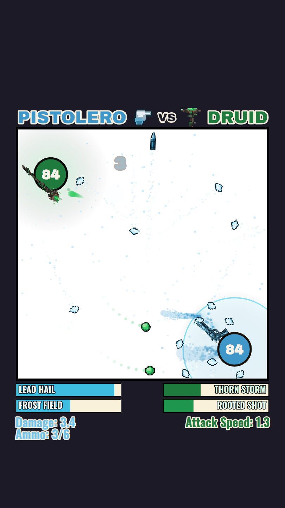
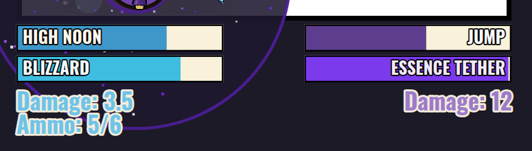
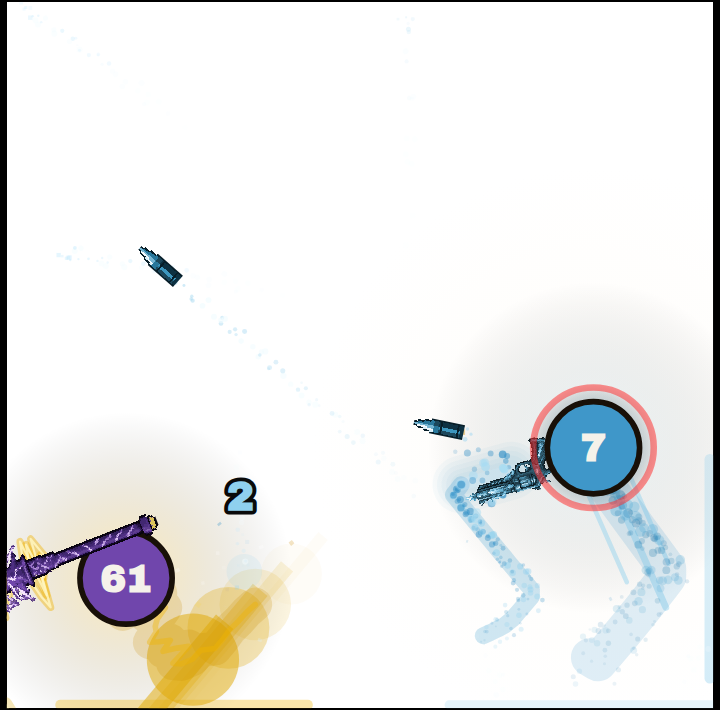

# Fiches des combattants

Huit éléments : **Ombre**, **Glace**, **Feu**, **Eau**, **Lumière**, **Foudre**,
**Vent**, **Plante**, plus trois personnages invités repris de la chaîne
« ballthingsim » — **Hors-la-loi** et **Bretteur** du duel *Outlaw vs
Bladesman*, et **Lancier** de *Dragoon vs Outlaw*.
Ces fiches sont la **transcription lisible** de `src/data/elements.js`. Le code
est la source de vérité : toute valeur ci-dessous existe telle quelle dans la
fiche gelée correspondante.

- `mesuré` = relevé sur les vidéos de référence, par échantillonnage d'images
  et analyse des pixels :
  | Vidéo | Éléments observés | Format |
  | --- | --- | --- |
  | `DARK vs ICE` | Ombre, Glace | 720 × 1280, 60,4 s |
  | `LIGHT vs FIRE` | Lumière, Feu | 576 × 1024, 42,5 s |
  | `LIGHT vs DARK` | Lumière, Ombre | 576 × 1024, 73,0 s |
  | `LIGHT vs LIGHTNING` | Lumière, Foudre | 576 × 1024, 61,2 s |
  | `ICE vs LIGHT` | Lumière | 576 × 1024, 121,4 s |
  | `LIGHT vs PLANT` | Lumière, Plante | 576 × 1024, 114,6 s |
  | `FIRE vs WATER` | Feu, Eau | 576 × 1024, 64,3 s |
  | `WIND vs PLANT` | Vent, Plante | 576 × 1024, 80,6 s |
  | `WIND vs LIGHT` | Vent | 576 × 1024, 68,7 s |
  | `WIND vs LIGHTNING` | Vent | 576 × 1024, 46,9 s |
  | `WIND vs WATER` | Vent | 576 × 1024, 63,1 s |
  | `PLANT vs FIRE` | Plante, Feu | 576 × 1024, 62,2 s |
  | `FIRE vs LIGHTNING` | Feu | 576 × 1024, 40,3 s |
  | `FIRE vs LIGHT` (long) | Feu | 576 × 1024, 68,5 s |
  | `ICE vs PLANT` | Plante | 576 × 1024, 93,7 s |
  | `DARK vs PLANT` | Plante, Ombre | 576 × 1024, 99,0 s |
  | `DARK vs LIGHTNING` | Ombre | 576 × 1024, 48,1 s |
  | `DARK vs FIRE` | Ombre | 576 × 1024, 54,8 s |
  | `Outlaw vs Bladesman` | Hors-la-loi, Bretteur | 576 × 1024, 30 fps, 1159 images, 38,6 s |

  Toutes sauf la première sont en 576 × 1024, soit exactement 0,8 × son format :
  mêmes proportions d'arène, valeurs converties par ×1,25.
- `calé` = ajusté par simulation pour retrouver le rythme observé
  (durée de duel, progression des deux compteurs du HUD).

Les fiches sont **immuables** : `deepFreeze` les gèle au chargement du module et
`assertFrozen()` le revérifie au lancement de chaque duel. Un duel ne peut donc
pas déteindre sur le suivant.

**Un seul écart volontaire au relevé** : le fond hors-arène. La vidéo est sur
papier crème `rgb(249,241,218)`, le site l'a remplacé par une encre sombre
`#1c1a26` (`STAGE.paper`), et le filigrane de la chaîne n'est pas reproduit.
L'arène, elle, reste blanche : tout le pixel-art garde donc exactement ses
contours noirs mesurés. Seul le « chrome » posé sur le fond sombre change de
liseré — titre et lignes de stat passent au crème `STAGE.outline`, et les jauges
d'ultime gardent une **plaque crème** pour que leur intérieur reste celui de la
vidéo, libellé noir compris.

---

## ⬤ OMBRE — `shadow` (affiché « DARK »)

> Assassin — se déplace par pas d'ombre et draine l'essence.

### Apparence

| Propriété          | Valeur                                  | Source  |
| ------------------ | --------------------------------------- | ------- |
| Rayon du corps     | 41 px                                   | mesuré  |
| Couleur du corps   | `#870286`                               | mesuré  |
| Contour            | `#0a0a0a`, 5 px                         | mesuré  |
| PV                 | Archivo Black 34 px, noir, centré       | mesuré  |
| Flash d'encaissement | corps blanc pendant 0,2 s             | mesuré  |
| Halo               | violet `rgba(124,58,237,.42)`, 1,62 × rayon, pulsation 2,4 Hz | mesuré |
| Condition du halo  | Pas d'ombre rechargé                    | déduit  |
| Traînée            | `rgba(88,28,135,.30)`, image toutes les 45 ms | mesuré |
| Icône du titre     | orbe violette 16 × 16 px                | mesuré  |

### Déplacement

| Propriété               | Valeur     | Source |
| ----------------------- | ---------- | ------ |
| Vitesse nominale        | 440 px/s   | mesuré |
| Vitesse de virage       | 1,75 rad/s | mesuré |
| Poids du pilotage (`seek`) | 0,42    | calé   |
| Rebonds                 | élastiques sur les 4 murs, le sens de rotation de l'arme s'inverse | mesuré |

### Arme — Lame du Néant

| Propriété              | Valeur                                | Source |
| ---------------------- | ------------------------------------- | ------ |
| Portée (centre → pointe) | 77 px                              | mesuré |
| Manche                 | 17 px, largement masqué par le corps  | mesuré |
| Tête                   | sprite `darkBlade`, ×3 (60 × 27 px)   | mesuré |
| Rotation               | 5,76 rad/s (330 °/s), sens initial anti-horaire | mesuré |
| Zone tranchante        | 42 % → 100 % de la portée, épaisseur 13 px | déduit |
| Dégâts                 | 5 PV                                  | calé   |
| Cadence                | 1 touche / 1,05 s maximum             | calé   |
| Recul infligé / subi   | 300 / 90                              | calé   |

### Pouvoir — Pas d'ombre (`Shadow Step`)

| Propriété              | Valeur                                            | Source |
| ---------------------- | ------------------------------------------------- | ------ |
| Recharge initiale      | 3 s                                               | mesuré |
| Réduction par usage    | −0,2 s, plancher 0,7 s                            | mesuré |
| Téléportation          | 190 px dans l'axe de course, 7 images fantômes    | mesuré |
| Invulnérabilité        | 0,25 s                                            | déduit |
| Accélération           | ×1,5 pendant 0,45 s                               | déduit |
| Volée                  | 3 traits d'ombre, dispersion ±0,38 rad, dans l'axe du saut | mesuré |
| Affichage HUD          | `Shadow Step Cooldown: X.Xs`                      | mesuré |

### Ultime — Lien d'essence (`ESSENCE TETHER`)

| Propriété          | Valeur                                             | Source |
| ------------------ | -------------------------------------------------- | ------ |
| Jauge              | +5,5 %/s, +3 % par touche portée                   | calé   |
| Durée              | **5,65 s** — chronométrée deux fois : 5,66 s et 5,63 s | mesuré |
| Dôme               | rayon 265 px (largeur médiane stable à 209 px ×1,25), **figé** au point d'incantation, `rgba(30,24,45,.88)` | mesuré |
| Débordement        | le dôme **n'est pas clippé à l'arène** : dans la vidéo il recouvre le bas de l'écran jusqu'au HUD | mesuré |
| Poussière          | 120 particules violettes en dérive dans le dôme    | mesuré |
| Rayon de drain     | trait violet + cœur blanc, relié en permanence     | mesuré |
| Drain              | **1 PV toutes les 0,4 s** — 10 PV en 4,5 s sur un dôme entier, soit 2,2 PV/s | mesuré |
| Ralentissement     | −15 % sur la cible tant que le lien tient          | déduit |

Le suivi automatique du dôme confirme aussi qu'il est bien **ancré** : sur ses
5,6 s d'existence, la distance entre son centre et l'Ombre passe de 71 px à
324 px — le combattant s'en éloigne, le dôme ne le suit pas.

### Projectile — Trait d'ombre

| Propriété | Valeur                       | Source |
| --------- | ---------------------------- | ------ |
| Sprite    | `darkBlade` ×2,2 (≈ 44 px)   | mesuré |
| Vitesse   | 600 px/s                     | calé   |
| Dégâts    | 5 PV                         | calé   |
| Rayon     | 11 px                        | déduit |
| Durée     | 1,5 s, **aucun rebond**      | mesuré |
| Traînée   | violette, tous les 50 ms     | mesuré |

---

## ❄ GLACE — `ice` (affiché « ICE »)

> Contrôle — empile les dégâts et le ralentissement.

### Apparence

| Propriété          | Valeur                                   | Source |
| ------------------ | ---------------------------------------- | ------ |
| Rayon du corps     | 41 px                                    | mesuré |
| Couleur du corps   | `#00eff0`                                | mesuré |
| Contour            | `#0a0a0a`, 5 px                          | mesuré |
| Halo               | cyan `rgba(34,211,238,.42)`, pulsation 2 Hz | mesuré |
| Condition du halo  | Blizzard chargé ou actif                 | déduit |
| Traînée            | `rgba(125,211,252,.28)`                  | mesuré |
| Icône du titre     | flocon 16 × 16 px                        | mesuré |

### Déplacement

| Propriété               | Valeur    | Source |
| ----------------------- | --------- | ------ |
| Vitesse nominale        | 470 px/s  | mesuré |
| Vitesse de virage       | 1,9 rad/s | mesuré |
| Poids du pilotage       | 0,42      | calé   |

### Arme — Hache de givre

| Propriété               | Valeur                                    | Source |
| ----------------------- | ----------------------------------------- | ------ |
| Portée                  | 132 px                                    | mesuré |
| Manche                  | 90 px, gris, gemme cyan à 52 %            | mesuré |
| Tête                    | sprite `iceAxeHead`, ×3,5 (42 × 60 px)    | mesuré |
| Rotation                | 5,76 rad/s, sens initial horaire          | mesuré |
| Zone tranchante         | 62 % → 100 % (seule la tête coupe), épaisseur 20 px | déduit |
| **Dégâts**              | **= pile courante** (`Damage/Slow`)       | mesuré |
| Cadence                 | 1 touche / 1 s maximum                    | calé   |
| Effet à la touche       | +1 pile ; ralentit de 3 %/pile (max 45 %) pendant 2,6 s | mesuré |
| Recul infligé / subi    | 260 / 80                                  | calé   |

La pile démarre à **1** et monte de **1 à chaque coup d'arme porté** : c'est le
compteur `Damage/Slow: N` du HUD, qui atteint 13 en fin de duel sur la vidéo.
C'est la mécanique de montée en puissance de la Glace — elle est faible au
début et létale à la fin.

### Pouvoir — Éclats de givre (`Frost Shards`)

| Propriété             | Valeur                                | Source |
| --------------------- | ------------------------------------- | ------ |
| Cadence               | 1 salve / 5 s                         | calé   |
| Salve                 | 7 éclats en étoile (360°)             | mesuré |
| Pendant le Blizzard   | 1 salve / 1,2 s, 10 éclats            | mesuré |

### Ultime — Blizzard (`BLIZZARD`)

| Propriété          | Valeur                                                 | Source |
| ------------------ | ------------------------------------------------------ | ------ |
| Jauge              | +5,4 %/s, +2 % par touche portée, remplissage **par la droite** | mesuré |
| Durée              | 5,2 s                                                  | mesuré |
| Onde de choc       | anneau cyan 40 → 900 px en 0,95 s, déborde de l'arène   | mesuré |
| Champ              | rayon 130 px, **suit la Glace**                        | mesuré |
| Effet du champ     | −35 % de vitesse, 1 PV toutes les 0,7 s                | calé   |
| Neige              | 90 flocons/s sur toute l'arène                         | mesuré |

### Projectile — Éclat de givre

| Propriété | Valeur                                  | Source |
| --------- | --------------------------------------- | ------ |
| Sprite    | `iceShard` ×2,4                         | mesuré |
| Vitesse   | 380 px/s                                | mesuré |
| Dégâts    | 2 PV                                    | calé   |
| Rayon     | 10 px                                   | déduit |
| Durée     | 3,4 s, **2 rebonds** sur les murs       | mesuré |
| Effet     | −12 % de vitesse pendant 1,6 s          | déduit |
| Traînée   | pointillé bleu pâle, tous les 35 ms     | mesuré |

---

## 🔥 FEU — `fire` (affiché « FIRE »)

> Attrition — marque l'adversaire d'une brûlure qui s'aggrave.

| Bloc | Valeur | Source |
| --- | --- | --- |
| Corps | rayon 41 px, `#fb0a0a`, contour noir 5 px | mesuré |
| Halo | orange, visible quand la Rage est chargée | mesuré |
| Déplacement | 480 px/s, virage 1,95 rad/s, pilotage 0,42 | calé |
| Arme | *Lame ardente* — portée 150 px, **aucun manche visible** : la garde anthracite à **gemme rouge** est posée au ras de la boule et fait partie du sprite `fireBlade` 28 × 9 ×4 (**112 × 36 px**) | mesuré |
| Détail de la lame | longue flamme effilée au **contour noir ondulé** : bord orange `rgb(242,146,8)`, corps jaune `rgb(251,182,3)`, cœur incandescent | mesuré |
| Corps à corps | 5 PV / 1,15 s, recul 240 | calé |
| **Effet à la touche** | **brûlure** : la pile monte de 0,5 (1 → 5,5 mesuré) ; le DoT inflige `pile/2,4` PV par seconde pendant `pile` secondes | mesuré |
| **Marquage visuel** | la brûlure fait **les deux à la fois** : elle **colore** la victime (la boule bleue de l'Eau vire au violet, la jaune de la Foudre à l'orange) **et** la **cercle d'un gros anneau orange**. Vérifié au zoom sur FIRE vs WATER | mesuré |
| Pouvoir | *Gerbe de braises* — 3 braises, dispersion ±0,55 rad, toutes les 3,6 s | calé |
| Cycle de l'ultime | jauge pleine toutes les **25 à 27 s** (mesuré sur la jauge) | mesuré |
| Ultime | *Rage infernale* (`INFERNAL RAGE`), 6 s : nova de **90 cubes orange**, ailes de flammes battantes, aura brûlante de 150 px (2 PV / 0,6 s + brûlure), vitesse ×1,2 | mesuré |
| Projectile | *Braise* — `ember` ×3, 520 px/s, 4 PV, embrase 2 s | calé |
| Jauge | +3,8 %/s, +1 % par touche portée — calé sur le cycle de 26 s | calé |
| HUD | `Burn Damage/Duration: N` — progression relevée sur 68 s : 1 → 1,5 → 2,5 → 3 → 3,5 → 4 → 4,5 → 5,5 → 6 → 6,5 → 7, par pas de 0,5 | mesuré |

La statistique fait **à la fois** les dégâts et la durée du DoT — c'est
littéralement ce qu'annonce son libellé dans la vidéo.

---

## 🛡 LUMIÈRE — `light` (affiché « LIGHT »)

> Contre-attaquant — ne commence pas fort, le devient en encaissant.

| Bloc | Valeur | Source |
| --- | --- | --- |
| Corps | rayon 41 px, `#fbf7a3`, contour noir 5 px | mesuré |
| Déplacement | 415 px/s (le plus lent), virage 1,6 rad/s | calé |
| Arme | *Marteau d'aube* — portée 155 px, hampe d'acier courte (31 px visibles) + sprite `lightHammerHead` 11 × 10 ×5,7 (**63 × 57 px**), tête **plus large que haute** au gros contour noir | mesuré |
| Halo | **doré**, allumé dès que le Piège radiant est chargé et pendant tout le trait — c'est **la Lumière** qui s'illumine, jamais sa cible | mesuré |
| Égide (aspect) | aucune bulle grise sur la vidéo : le bouclier se lit sur un **liseré doré** collé au corps, d'autant plus épais qu'il est plein | mesuré |
| **Dégâts du marteau** | **= stat « Shield Damage »**, donc **1 PV au premier coup** | mesuré |
| Cadence | 1 coup / 1,5 s — la plus lente du roster | calé |
| **Recul** | **= stat « Knockback »** : 1500 au départ, traduit en impulsion `210 + stat × 0,05` | mesuré |
| **Montée en puissance** | les deux stats montent de **+1 / +300 quand la Lumière ENCAISSE un coup franc**, jamais quand elle en porte | mesuré |
| Plafonds | 14 et 5400 (= 1500 + 13 × 300) — les valeurs maximales vues sur le duel le plus long | mesuré |
| Délai de conversion | 1,5 s entre deux gains (la vidéo monte d'environ un cran toutes les 3 s) | calé |
| **Dégâts de zone** | blizzard, brûlure, tourbillon : **ne font monter aucun compteur** — vérifié sur un blizzard qui coûte 30 PV à la Lumière sans bouger la stat | mesuré |
| **Bouclier** | capacité `9 + stat × 0,4`, régénération 2/s après 2,4 s de répit, rechargé à bloc toutes les 9 s ; absorbe avant les PV — la Lumière tient 11 s à 100 PV sous les coups | mesuré |
| **Riposte** | 1 PV rendu à l'attaquant à chaque coup encaissé | mesuré |
| Incantation | **aucune** — l'Égide est purement passive, aucune onde de choc n'apparaît dans les quatre vidéos | mesuré |
| Ultime | *Piège radiant* (`RADIANT SNARE`), 5 s : **double trait doré**, la cible est **teintée en jaune pâle**, ralentie de 55 %, tirée vers la Lumière et drainée d'**1 PV par seconde** | mesuré |
| Projectile | aucun — tout passe par le marteau et le piège | mesuré |
| HUD | `Shield Damage: N` **et** `Knockback: M` (deux lignes) | mesuré |

### Comment la mécanique a été établie

Trois relevés image par image, à 0,1 s d'intervalle, sur `LIGHT vs LIGHTNING`,
`LIGHT vs PLANT` et `ICE vs LIGHT` :

1. **t = 3,37 s** — la Lumière clignote en blanc (elle encaisse), ses PV
   **ne bougent pas** (100 → 100), la stat passe de 2 à 3, le recul de 1800 à
   2100, et l'adversaire perd 1 PV dans la foulée : c'est la riposte.
2. **t ≈ 5,0 s** — l'adversaire perd **3 PV** d'un coup alors que la stat vaut
   3, et la stat **ne bouge pas** : le marteau frappe pour la valeur affichée.
3. **t = 36 → 41 s** — pendant un blizzard, la Lumière perd 30 PV et ses deux
   compteurs restent figés : les dégâts de zone ne nourrissent pas l'Égide.

Le duel `ICE vs LIGHT` montre aussi la cible du piège **prendre la couleur
pâle de la Lumière**, et la Lumière **verdir** quand elle est givrée — un voile
bleuté posé sur son jaune. Cette teinte d'état est désormais générique :
`onHit.tint` dans la fiche, avec un alpha de mélange.

---

## 🌪 VENT — `wind` (affiché « WIND »)

> Harcèlement — le plus rapide, tornades et lames d'air.

| Bloc | Valeur | Source |
| --- | --- | --- |
| Corps | rayon 41 px, `#bcbf9e`, contour noir 5 px | mesuré |
| Déplacement | **500 px/s**, virage 2,2 rad/s — le plus mobile du roster | mesuré |
| Arme | *Shuriken de bourrasque* — portée 105 px, **aucun manche** (le losange est posé à même la boule), sprite `windShuriken` 17 × 17 ×4,35 soit **74 × 74 px** | mesuré |
| Détail du shuriken | anneau en losange évidé : **double contour noir** (extérieur *et* pourtour du trou), corps crème dégradé — clair côté intérieur, chaud côté extérieur — et **quatre ergots gris** qui dépassent aux pointes | mesuré |
| Rotation d'arme | 6,34 rad/s (× 1,1 par rapport au reste du roster) | mesuré |
| Corps à corps | 3 PV / 1 s (la cadence la plus rapide), ralentit de 12 % | calé |
| **Tornade** | **rafale de 0,2 s, rayon 125 px, centrée sur le Vent lui-même** — pas un vortex lancé au loin ni une zone qui dure | mesuré |
| Aspect de la rafale | **disque flou couleur sable** fait de 9 larges pales en éventail qui rayonnent du centre et se chevauchent, cœur plus dense (`rgb(168,152,124)`), bord franc — pas des cercles concentriques | mesuré |
| Effet de la rafale | `stat / 2` PV et une projection de 430 à qui se trouve dedans | calé |
| Cadence | part sur 4 s et **s'accélère à chaque rafale** (−0,15 s), jusqu'à un plancher de 0,5 s | mesuré |
| **Double progression** | une rafale **qui touche** : dégâts +2 (10 → 24, plafond) **et** recharge −0,5 s de plus | mesuré |
| Ultime | *Salve de tempête* (`TEMPEST VOLLEY`) : jauge pleine toutes les ~9 s, puis décharge **courte et dense** de 1,5 s (2 croissants toutes les 0,3 s) + vitesse ×1,25 | mesuré |
| Projectile | *Lame d'air* — `windCrescent` 16 × 16 ×3,6 (≈ 58 px), 430 px/s, 3 PV, 1 rebond. **Vrai croissant sans contour** (deux cercles décalés), corne sombre côté traînée, ventre crème, liseré clair sur le dos convexe | mesuré |
| HUD | `Tornado Damage: N` **et** `Cooldown: X.Xs` (deux lignes) | mesuré |

### Comment la tornade a été établie

Détection automatique image par image sur trois duels (`WIND vs LIGHT`,
`WIND vs LIGHTNING`, `WIND vs PLANT`), en isolant les pixels bruns du
tourbillon puis en comparant son centre à celui des deux combattants :

1. **Durée** — 4 à 6 images à chaque fois, soit 0,13 à 0,20 s. Ce n'est pas
   une zone qui persiste : c'est une rafale.
2. **Position** — sur 18 déclenchements, le centre du tourbillon est à moins
   de 30 px du Vent (souvent moins de 10). Il l'invoque autour de lui.
3. **Cadence** — les intervalles mesurés descendent régulièrement :
   4,8 · 4,1 · 4,2 · 3,4 · 2,7 · 2,4 · 2,1 · 1,9 · 2,2 · 2,1 · 1,9 · 1,7 ·
   1,3 · 1,4 · 1,4 · 1,5 s. Deux vidéos donnent la même courbe.
4. **Progression** — 17 rafales pour seulement 7 avancées du couple affiché
   (10/4 s → 24/0,5 s, par pas de +2 / −0,5). Les incantations qui ne
   rapportent rien sont celles où l'adversaire était loin : ce sont donc les
   rafales **qui touchent** qui font progresser.

Ces deux rythmes distincts — la cadence qui s'accélère à chaque rafale, le
couple affiché qui n'avance qu'aux rafales réussies — sont reproduits par deux
décréments séparés dans la fiche (`cooldownStepOnCast` et `cooldownStep`).

### Reskin — Shinobi

**Réactivé et redessiné à la demande, comme le Bretteur avant lui.** Le Vent
était `DISABLED` ; il rejoint `PLAYABLE`, déplacé en queue de `ROSTER` (après
le Lancier, pas à sa place d'origine) pour ne pas déplacer le camp A des six
duels déjà établis entre Hors-la-loi, Bretteur et Lancier — voir `CLAUDE.md`
pour le détail. `id: 'wind'` ne change pas ; seuls `name`/`nameRef`
(`VENT`/`WIND` → `SHINOBI`/`SHINOBI`), l'arme et les projectiles bougent.

| Ce qui change | Détail | Source |
| --- | --- | --- |
| Arme | *Shuriken de bourrasque* → *Shuriken de flamme* (`Flame Shuriken`) — huit branches de métal sombre cerclées de flamme continue, crâne de dragon au centre | maquette |
| Projectile | `crescent` (lancé par `ultimate.volley`) : sprite `windCrescent` → `windShuriken`, `scale` 3,6 → 4,35, `radius` 12 → 15 | demandé, calé |

**L'arme et le projectile partagent maintenant le même sprite, à la même
échelle (4,35).** « Des shurikens de la même taille » : le projectile lancé a
exactement la taille dessinée de l'arme en main (~74 px), pas une taille
propre — contrairement à l'ancien croissant (58 px). Le rayon de collision du
projectile suit la même proportion (12 → 15) pour que la hitbox ne mente pas
sur un projectile devenu plus grand.

**Un vrai PNG, directement — pas de pixel-art texte intermédiaire.**
`head.sprite: 'windShuriken'` est servi par
`assets/sprites/shinobi-shuriken.png` (déclaré dans
`assets/sprites/manifest.json`), un recadrage de la maquette fournie sur sa
plus grande composante connexe — même méthode que la lame du Bretteur.
Différence notable : cette maquette isolait mal l'objet du damier de
transparence sur ses zones sombres (le disque derrière le crâne, les creux
entre les branches) — un simple retrait de fond y laissait des poches de
damier visibles, contrairement à la lame dont le fond se retirait proprement.
`cv2.inpaint` (méthode Telea) a rebouché ces poches à partir des pixels
voisins, sans toucher au reste de l'image.

**Reach et hitbox de l'arme inchangés : c'est un reskin, pas un
rééquilibrage.** Le PNG recadré (198 × 200) est quasi carré, comme l'était
déjà `WIND_SHURIKEN` (17 × 17, resté en repli texte) : `handle.length` et
`head.scale` retombent donc sur la même taille dessinée (~74 px) sans le
moindre recalcul.

**Corps passé au noir, à la demande.** `look.body` `#bcbf9e` → `#141414`.
Le contour (`outline`) et le chiffre de PV (`hpColor`) étaient déjà proches du
noir (`#0a0a0a`) : laissés tels quels, ils auraient disparu **noir sur noir**
sur le nouveau corps — le même piège déjà payé sur le Bretteur (voir sa
section, « HP au-dessus de la manche »). Contour repassé à l'orange de braise
du shuriken (`#e8621b`), chiffre de PV au crème mesuré du reste du roster
(`#f5f2ea`). Vérifié à l'écran (`tools/shot.mjs`), lisible dans toutes les
configurations testées. Purement visuel, matrice inchangée.

**Relevé de matrice initial : 0/9 contre les trois autres actifs, 3/3 en
miroir.** Aucune valeur de combat n'avait été retouchée à la hausse ou à la
baisse (le rayon de collision du projectile avait même légèrement augmenté) :
c'était le relevé du Vent d'origine, sous la moyenne dans l'historique à onze
combattants (12/30), confronté aux trois invités les plus agressifs du roster
réduit plutôt qu'à dix adversaires variés. Ce résultat a changé depuis — voir
« Corps au noir et Clone d'ombre » ci-dessous.

### Corps au noir, et Clone d'ombre

**Aura et traînée passent au noir, à la demande.** `look.aura.color`
(`rgba(214,205,170,…)` → `rgba(20,20,20,…)`) et `look.trail.color`
(`rgba(207,198,168,…)` → même noir) : dernier vestige khaki-crème du reskin
d'avant le corps noir. `look.flair` (ruban, motes, éclair d'incantation)
n'est pas touché, non demandé. Purement visuel.

**Nouveau pouvoir demandé : un clone de lui-même, 20 PV.** Troisième
créneau greffé (même patron que le Blizzard/la Rage infernale/le Lien
d'essence), mais **conçu** pour le Shinobi plutôt que repris d'un autre
combattant — voir `CLAUDE.md` pour le détail technique (pourquoi il est
stationnaire et incorporel, comment il réutilise `Fighter.prototype` et
`weaponHit()`). En résumé :

| Trait | Valeur |
| --- | --- |
| PV | 20 (demandé) |
| Apparition | 5 s puis toutes les 12 s (après une mort), à 130 px derrière le Shinobi |
| Durée | **permanente** — demandé ; seuls ses PV le font disparaître |
| Riposte | shuriken vers l'adversaire toutes les 1,1 s, attribué au vrai Shinobi (charge son ultime) |
| Rendu | identique au vrai combattant (même prototype `Fighter`), 88 % d'opacité |
| Jauge | `SHADOW CLONE`, sous `TEMPEST VOLLEY`, mêmes couleurs |

**Relevé de matrice après ajout : 3/9 contre les trois autres actifs
(1/3 Hors-la-loi, 2/3 Bretteur, 0/3 Lancier), 3/3 en miroir inchangé.**
Toutes les lignes n'impliquant pas `wind` restent identiques au caractère
près. `tools/matrix-reference.txt` régénérée.

**Rendu permanent, second relevé : 4/9** (0/3 Hors-la-loi, **3/3** Bretteur,
1/3 Lancier). Le plafond de 6 s (`sp.duration`) est retiré de la fiche — plus
rien n'expire le clone, seuls ses PV le peuvent. Toujours confiné aux seules
lignes `wind` ; `tools/matrix-reference.txt` régénérée une seconde fois.

---

## ⚡ FOUDRE — `lightning` (affiché « LIGHTNING »)

> Zone — sème des bornes statiques et enchaîne les arcs.

| Bloc | Valeur | Source |
| --- | --- | --- |
| Corps | rayon 41 px, `#f2f003`, contour noir 5 px | mesuré |
| Halo | **cyan et permanent** : sur LIGHT vs LIGHTNING, la boule jaune porte son halo bleu du début à la fin du duel, décharge ou pas — c'est sa signature à l'écran | mesuré |
| Déplacement | 500 px/s, virage 2 rad/s | calé |
| Arme | *Lame fulgurante* — portée 145 px, **long manche de bois brun** (88 px) surmonté d'un **fer de lance jaune** trapu au gros contour noir : sprite `boltBlade` 14 × 9 ×4 (**56 × 36 px**), pas un zigzag plat | mesuré |
| Corps à corps | 3 PV / 1 s ; **plante une borne à l'impact** ; pile +0,5 | mesuré |
| **Bornes** | sprite `teslaNode` ×2,6 (**34 × 34 px**), 8 au maximum (la plus ancienne disparaît), durée 16 s, une posée toutes les 3 s | mesuré |
| Aspect des bornes | ce n'est pas un cristal mais une **petite bobine** : boule au sommet, deux disques à collerette empilés, deux pieds, blanc lavande à contour bleu nuit | mesuré |
| **Chaîne** | toutes les 1,6 s : arc Foudre → jusqu'à 4 bornes → adversaire s'il est à ≤ 270 px du dernier maillon ; inflige la pile et ralentit de 18 % | mesuré |
| Ultime | *Surcharge* (`SUPERCHARGE`), 5 s : chaîne toutes les 0,5 s, portée ×1,5, vitesse ×1,15. Sur la vidéo, la jauge se vide à 13 s, 32 s et 55 s, et chaque vidage déclenche **la grande toile cyan** qui relie toutes les bornes | mesuré |
| Projectile | aucun — les bornes et les arcs tiennent ce rôle | mesuré |
| HUD | `Chain Damage: N` (1 → 4,5 mesuré) | mesuré |

---

## 🌀 EAU — `water` (affiché « WATER »)

> Contrôle de terrain — des tourbillons qui aspirent et grandissent.

| Bloc | Valeur | Source |
| --- | --- | --- |
| Corps | rayon 41 px, `#4a86f7`, contour noir 5 px | mesuré |
| Déplacement | 455 px/s, virage 1,8 rad/s | calé |
| Arme | *Trident des marées* — portée 150 px, hampe acier-bleu 102 px + sprite `waterTrident` ×4 (48 × 60 px), **contour noir** et non bleu nuit | mesuré |
| Corps à corps | 3 PV / 1,1 s ; pile +1 **et** taille +5 | mesuré |
| **Tourbillon** | posé toutes les 6 s à l'endroit courant, 2 simultanés au plus, 7,5 s ; **rayon = stat « Size » × 0,9** ; aspiration 60 ; `pile × 0,6` PV toutes les 1,2 s | mesuré |
| **Aspect du tourbillon** | pas un dégradé tournoyant : une **vraie spirale en pixels, opaque** — disque bleu `rgb(102,151,217)`, bras bleu nuit enroulé sur ~2,5 tours, éclats clairs sur un bord, gros contour. Sprite `waterWhirlpool` 21 × 21 étiré au diamètre courant et tourné lentement (1,1 rad/s) | mesuré |
| Gouttes | chaque tourbillon crache 1 goutte toutes les 1,8 s | calé |
| Ultime | *Maelström* (`MAELSTROM`), 5,5 s : **la même spirale**, deux fois plus grande (200 px), au centre de l'arène, aspiration 170, `pile` PV toutes les 0,8 s | calé |
| Projectile | *Goutte* — `waterDrop` ×3, 330 px/s, 1 PV, 1 rebond | calé |
| HUD | `Whirlpool Damage: N` **et** `Size: M` (deux lignes). Le duel FIRE vs WATER pousse plus loin que le relevé initial — 1 → 17 et 70 → 150 — et la **valeur affichée est littéralement le diamètre du tourbillon en pixels**. La progression du jeu reste calée sur 1 → 7 / 70 → 100 : ce point d'équilibrage n'a pas été retouché ici. | mesuré |

---

## 🌱 PLANTE — `plant` (affiché « PLANT »)

> Endurance — sème des bulbes qui blessent l'un et soignent l'autre.

| Bloc | Valeur | Source |
| --- | --- | --- |
| Corps | rayon 41 px, `#15c701`, contour noir 5 px | mesuré |
| Déplacement | 445 px/s, virage 1,7 rad/s | calé |
| **Arme** | *Liane fouettante* — portée 160 px. **Seule arme courbe du roster** : pédoncule brun de 30 px visibles, puis un **crochet** — arc de rayon 46,7 px balayé sur 151°, épaisseur 20 px au plus large | mesuré |
| Rendu de la liane | pas un tracé lisse : l'arc est **rasterisé en escalier de blocs de 4 px** (contour noir, corps vert, reflet clair côté concave), compilé une fois en sprite puis tourné en plus-proche-voisin — exactement le rendu de la vidéo | mesuré |
| Corps à corps | 3 PV / 1,15 s, recul 235 ; pile +1 | calé |
| **Bulbes** | semés toutes les 5 s à l'endroit courant, 4 au plus, durée 18 s, rayon 36 px, **amorçage 0,9 s** (sinon la Plante ramasserait le sien aussitôt posé) | mesuré + calé |
| **Mine** | l'adversaire qui frôle un bulbe prend la stat en PV et est ralenti de 25 % pendant 1,6 s | mesuré |
| **Soin** | la Plante qui récupère son bulbe **regagne `stat × 0,6` PV** — le seul élément du roster capable de remonter ses PV | mesuré |
| Tir des bulbes | un bulbe mûr tire une fleur sur l'adversaire toutes les 2,2 s, portée 460 px | mesuré |
| Ultime | *Tempête de fleurs* (`FLOWER STORM`), 5 s : la cible est clouée sur place (−70 %) et battue par une nuée de pétales (`stat/4` PV toutes les 0,7 s), pendant que la Plante regagne 1 PV/s | mesuré |
| Aspect de la tempête | **nuée de cubes roses** : des grappes de carrés plats et opaques (`rgb(248,120,184)`), toujours alignés sur les axes, sans contour ni dégradé, denses au point de masquer complètement la cible, mêlées de quelques corolles. **Aucun cerceau de lianes** sur les vidéos | mesuré |
| Bulbe | cosse verte bombée au **gros contour noir**, pédoncule et deux feuilles sombres au-dessus, deux pattes noires en dessous — `plantBulb` 11 × 15 ×2,5 (≈ 29 × 37 px) | mesuré |
| Projectile | *Fleur* — `flower` 11 × 11 ×3,6 (≈ 40 px), corolle rose à contour noir épais et **cœur doré**, 340 px/s, 2 PV, traînée rose | mesuré |
| HUD | `Bulb Damage/Heal: N` (1 → 8 mesuré) | mesuré |

Le libellé du HUD dit tout : la **même** statistique sert de dégâts à
l'adversaire et de soin à la Plante.

---

## 🤠 HORS-LA-LOI — `outlaw` (affiché « OUTLAW »)

> Pistolero — vise, tire, recule, et affûte ses dégâts balle après balle.

Relevé sur *Outlaw vs Bladesman*, en 576 × 1024 : **toute mesure ci-dessous est
convertie ×1,25** vers le repère 720 × 1280 du jeu, et la valeur d'origine est
citée entre parenthèses.

| Bloc | Valeur | Source |
| --- | --- | --- |
| Corps | rayon 41 px (32), `#8a5934` — pipette (138,89,52), médiane érodée sur titre + bille + jauge | mesuré |
| Flash d'encaissement | `#e4e4e6` — mesuré aux images 223/224/225 : le disque touché blanchit **une image entière**, contour compris | mesuré |
| Chiffre de PV | crème `#f5f2ea` : le seul ton lisible sur le brun sombre | mesuré |
| Déplacement | 546 px/s. Calé à 455 (relevé 483 → 604 après conversion), sinon il traverse le cadre plus vite qu'il ne recharge ; **écart assumé, demandé** ensuite : ×1,2 → 546, toujours sous le 604 mesuré | mesuré + calé + demandé |
| **Arme** | *Revolver* — portée 122 px (pointe du canon à 97). **Seule arme du roster qui ne tourne pas** : `weapon.spin = 0`, et le module écrit `weaponAngle` à chaque image. Le relevé est explicite — « le canon est asservi à l'adversaire à chaque image, sans lissage » | mesuré |
| Sprite | 34 × 15 cellules ×2,5 : crosse brune côté bille, carcasse et barillet en acier bleuté-violine, puis un **canon fin** de 6 cellules sur 15. C'est le contraste corps épais / canon fin qui identifie l'arme | mesuré |
| Corps à corps | pile courante en PV, toutes les **3 s** — le verrou le plus long du roster, parce que le canon est **toujours** aligné. À 1,5 s le pistolero gagnait 27 duels sur 27 | calé |
| **Barillet** | 6 coups, ~0,6 s entre deux (≈ 18 images à 30 fps), puis un rechargement de 1,4 s — le trou observé entre `0/6` et `6/6` | mesuré + calé |
| **Recul** | 119 px/s par coup (95), **988 px/s (790) sous HIGH NOON**. C'est lui qui produit le pic de 1 380 px/s relevé à l'image 1011 : chaque coup de la rafale le propulse violemment | mesuré |
| **Dispersion** | ±0,75 rad. **Déduite d'une mesure** : la vidéo montre 25 paliers de +0,10 en 38,6 s pour ~50 tirs, soit une balle sur deux et **0,65 coup/s**. Sans dispersion, une visée réécrite à chaque image touche toujours — le banc donnait 1,30 coup/s, exactement le double | déduit |
| Ultime | *Plein soleil* (`HIGH NOON`) — horloge **pure** de 7,0 s (charge de 1,13 px/image sur 238 px utiles), effet 6,2 s (vidage à 1,28 px/image) : cadence doublée, +22 % de vitesse, recul ×8,3 | mesuré |
| Rendu de l'ultime | la vidéo fait virer **toute l'arène** au crème `#FDF7ED`. Ici le décor ne bouge jamais : la lumière se pose **au sol, sous le pistolero** | écart assumé |
| Projectile | *Balle* — `outlawShot` 9 × 3 ×3,2, 720 px/s, dégâts = la pile courante. Sillage **pâle** de 2 px, (213,182,153) à (236,206,177) : les cinq taches alignées de l'image 224 sont ce sillage en tirets, pas cinq projectiles | mesuré + calé |
| HUD | `Damage: 3.00 → 5.50` (+0,10 **au coup au but**, pas au coup tiré) et `Ammo: n/6` | mesuré |

---

## ⚔ BRETTEUR — `bladesman` (affiché « BLADESMAN »)

> Duelliste — sa lame accélère jusqu'à la surchauffe, puis fond sur sa cible.

| Bloc | Valeur | Source |
| --- | --- | --- |
| Corps | rayon 41 px (32), `#dcc462` — pipette (220,196,98) | mesuré |
| Chiffre de PV | encre sombre `#2a2007`. **Écart assumé** : la vidéo l'écrit en crème avec un contour, ce moteur ne pose aucun contour et le crème sur l'or clair est illisible | écart assumé |
| Déplacement | 560 px/s (relevé 605 → 756 après conversion) — le plus rapide du roster, ce que dit le relevé, sans aller jusqu'aux 756 qu'une lame de 152 px rendrait intenable | mesuré + calé |
| **Arme** | *Sabre dentelé* — portée 152 px : garde à 45–56 (36–45), lame à 56–152 (45–122). La portée **découle** du sprite, jamais écrite en dur | mesuré |
| Sprite | 40 × 16 cellules ×2,68. Garde **orange vif** (232,160,40), petite croix trapue. Lame **asymétrique** — bande gris-brun sur l'arête haute, corps ivoire en bas — et **fuselée** : une lame à côtés parallèles donne un bout carré que le relevé n'a pas. Les deux arêtes sont dentées, d'où l'aspect scie | mesuré |
| **Rotation** | plancher **0,80** tour/s, plafond **3,00**, jamais franchis. Montée passive **+0,21/s**, sauts discrets de **+0,15** — un par coup porté. Au plafond : palier d'environ **1,8 s** (55 images), puis effondrement à **−3,0/s** jusqu'au plancher, et le cycle repart. Quatre cycles visibles : plafonds aux images 231, 441, 681, 951 | mesuré |
| Ce qui déclenche l'effondrement | **non identifiable sur la vidéo** : il ne coïncide ni avec BLADE RUSH, ni avec HIGH NOON. Le modèle de surchauffe après palier reproduit exactement la courbe — c'est un `calé`, pas un `mesuré` | calé |
| Corps à corps | `Damage = 2,00 × Spin Speed`, **exact et sans exception**, soit 2 à 6 PV. Verrou de 1 000 ms entre deux touches. **Ajout demandé** : brûlure d'un tic à l'impact — voir « Brûlure et Rage infernale » | mesuré + demandé |
| Ultime | *Ruée de lame* (`BLADE RUSH`) — horloge de 9 s **+ 6 % par coup porté** : les cycles relevés font 273, 214 et 333 images, donc pas une simple horloge. Ruée de 1,5 s minutée, vitesse ×1,55 (939 px/s contre 605), verrou de touche à **115 ms** | mesuré |
| Deux régimes de la ruée | **loin**, cap asservi sur l'adversaire à pleine vitesse ; **à portée** (120 px), la lame **orbite**. Foncer droit dessus traverse la zone utile en une centaine de millisecondes — au banc d'origine la lame n'y restait que 57 % de la ruée pour un seul coup porté | mesuré + calé |
| **Éventail vert** | `#B1C404` à 55 % — mesuré image 643 : le cœur rend (211,219,109) sur l'arène crème. Ouverture bornée **en angle** : 1,6 rad en régime normal, 3,0 rad pendant la ruée, où il vire au vert fluo. L'aire verte passe de ~3 500 px² à 18 488 px² au pic, un facteur 5,3 : l'éventail **s'ouvre**, il ne fait pas que changer de teinte | mesuré |
| Rendu de l'éventail | en régime normal c'est le **ruban de pointe d'arme** (`look.flair.ribbon`), qui est exactement le secteur balayé par la lame ; le surcroît d'ouverture de la ruée est un secteur plein tracé par le module | — |
| Projectile | aucun — tout passe par la lame | mesuré |
| HUD | `Spin Speed: 0.80 → 3.00` et `Damage: 1.6 → 6.0`, ce dernier **jamais stocké** : il est dérivé de la pile à l'affichage, deux valeurs séparées finissant toujours par diverger | mesuré |

### Reskin — lame de braise

**Réactivé et redessiné, à la demande.** Le Bretteur était `DISABLED` ; il
rejoint de nouveau `PLAYABLE`, entre le Hors-la-loi et le Lancier (queue de
`ROSTER`, comme l'exige `tools/matrix.mjs`). Trois écarts assumés au relevé,
tous purement visuels — aucune valeur `mesuré`, `calé` ou `déduit` de gameplay
n'a bougé :

| Ce qui change | Détail | Source |
| --- | --- | --- |
| Corps | `#dcc462` (or clair) → `#e8621b` (orange de braise) | écart assumé |
| Aura passive | `rgba(172,226,22,0.42)` (vert-jaune) → `rgba(255,69,0,0.45)` (rouge flamme) | écart assumé |
| Arme | *Sabre dentelé* → *Lame de braise* (`Ember Blade`), transcrite d'une maquette fournie — garde ailée sombre à gemme rouge, lame en flamme continue. `BLADESMAN_FLAMEBLADE` dans `pixelmaps.js`, méthode identique à `LANCER_SPEAR` (réduction par blocs, quantification, pas un dessin reconstruit) | maquette |

**La portée ne bougeait pas, à ce stade.** `head.scale` est recalculé pour le
nouveau sprite (96 cellules contre 40) afin que `handle.length + sprite ×
scale` retombe exactement sur les 152 px relevés — un reskin ne change pas la
hitbox. (Elle bouge en revanche à la vague suivante, où l'agrandissement de la
lame *est* la demande — voir « Lame agrandie, cendres et bas d'écran orange ».)

**L'éventail vert de BLADE RUSH n'a pas été touché.** Il reste `#B1C404`,
mesuré image 643 : c'est un effet vidéo, pas une couleur de thème, et rien
dans la demande ne portait dessus. Le combattant affiche donc un corps et une
aura en rouge-orangé avec un swing d'ultime resté vert — assumé, pas oublié.

**Bilan de matrice, au moment du reskin.** Rejoindre le roster jouable fait
passer `tools/matrix.mjs` de 3 à 6 affrontements (3 combattants, paires
`i ≤ j`, 3 seeds — 18 duels). Le Bretteur perdait alors ses six duels contre le
Hors-la-loi et le Lancier (0/6) — le relevé de sa fiche d'origine (9/30 dans
l'historique à onze combattants), inchangé par ce reskin purement visuel.
Aucun paramètre `calé` n'avait été retouché pour le remonter : ce n'était pas
demandé, et le toucher aurait signifié s'écarter du relevé sans nouvelle
mesure. **Ce qui suit — brûlure au contact et Rage infernale — est un ajout
ultérieur, distinct du reskin, qui touche cette fois au gameplay : voir
« Brûlure et Rage infernale » ci-dessous.**

### Brûlure et Rage infernale

**Deux ajouts demandés, après le reskin — cette fois du gameplay, pas
seulement du visuel.** Contrairement au reskin ci-dessus, dont le bilan de
matrice était resté à l'identique, ces deux-là déplacent la matrice — c'est
attendu et documenté, pas une dérive.

| Ajout | Détail | Source |
| --- | --- | --- |
| Brûlure au contact | `weapon.melee.onHit.dot` — chaque coup de lame marque la cible d'un tic de brûlure, `Math.max(1, round(Spin Speed))`, sur 1 s | demandé, calé |
| Rage infernale | pouvoir **greffé** en troisième créneau (`special.infernalRage`), même patron que le Blizzard et le Lien d'essence — voir la section suivante | demandé |
| Aura et sillage | `look.aura` et `look.trail` passent du vert-jaune/or terne aux teintes exactes de l'aura du Feu (`#f97316`) | écart assumé |

**La brûlure est le vrai levier, la Rage infernale presque pas.** Premier
essai à 2 s de durée (deux tics par coup porté) : le Bretteur balayait les
deux autres actifs, 5/6 contre 0/6 avant l'ajout — la brûlure s'additionnait à
des dégâts au contact déjà mesurés (`Damage = 2 × Spin`) sans que sa cadence de
touche n'ait bougé. Isoler la Rage infernale seule (brûlure quasi neutralisée,
`duration: 0.01`) reproduisait quasi exactement la matrice d'avant l'ajout —
la preuve que l'aura de la Rage infernale (`tickDamage: 1` toutes les 0,6 s)
ne pesait presque rien à côté. Ramener la brûlure à **1 s (un seul tic)**
donne 2/6 : le Bretteur gagne un vrai avantage sur son relevé d'origine, sans
en devenir le plus fort du roster réduit.

**La Rage infernale n'utilise ni `f.boost` ni `f.boostFactor`.** BLADE RUSH
s'en sert déjà pour son propre sprint (vitesse ×1,55 pendant la ruée) ; lui
faire partager le même compteur générique aurait fait qu'une ruée qui se
termine coupe une Rage infernale encore active, ou l'inverse. Les deux
horloges (`f.ult.active` et `f.state.spec`) tournent donc indépendamment, et
peuvent être actives en même temps — l'aura brûlante se dessine alors
**avant** l'éventail de BLADE RUSH dans `drawUnder`, comme la lumière de HIGH
NOON passe par-dessus le champ de givre du Blizzard chez le Hors-la-loi.

**Relevé de matrice, après ces deux ajouts :** le Bretteur perd toujours 0/3
contre le Hors-la-loi (le duel par défaut reste donc à l'image de son relevé
d'origine), mais gagne 2/3 contre le Lancier — soit **2/6**, contre 0/6 avant.
`tools/matrix-reference.txt` a été régénérée ; seules les quatre lignes qui
impliquent le Bretteur ont bougé.

### Lame agrandie, cendres et bas d'écran orange

**Quatrième vague, demandée.** Trois ajouts sur le Bretteur, un sur le
Hors-la-loi (vitesse, voir sa fiche plus haut) :

| Ajout | Détail | Source |
| --- | --- | --- |
| Lame ×1,3 | `weapon.reach` 152 → 197,6 ; `handle.length` 45 → 58,5 ; `head.scale` 1,114583 → 1,448958 ; `hitbox.radius` 17 → 22,1. Les quatre bougent dans la même proportion : la pointe dessinée retombe exactement sur la nouvelle portée (invariant 5), ce n'est pas un agrandissement visuel seul | demandé, calé |
| Cendres sur l'arme | `look.flair.weaponArc` (absent jusqu'ici), en mode `powder` — grains gris (`glow: '#3a332c'`) et braises ponctuelles (`core: '#fbbf24'`) le long de la lame, `jitter: 30` pour dépasser la demi-épaisseur du sprite agrandi (≈25,4 px) | demandé, écart assumé |
| Cendres en traînée | `look.flair.smear` (absent jusqu'ici) : le Bretteur n'avait aucun fuseau de vitesse ; il en gagne un en cendre, distinct du ruban de lame (orange) | demandé, écart assumé |
| Bas d'écran orange | `ultimate.barFill` (or `#dcc462` → orange `#f97316`), `special.barFill` (rouge `#dc2626` → orange sombre `#ea580c`), `hud.color` (or sombre `#a8912f` → orange `#f97316`) | écart assumé, demandé |

Les deux effets de cendre passent par `render/flair.js` (`weaponArc.powder`,
`smear.powder`, même mécanisme que le givre du Hors-la-loi) : purement
décoratifs, aucun tirage dans `game.rng`, ne peuvent rien changer au duel.
L'agrandissement de la lame, en revanche, est un vrai changement de gameplay :
une lame plus longue touche de plus loin.

**Relevé de matrice, après l'agrandissement de la lame et la vitesse du
Hors-la-loi :** le total du Bretteur reste **2/6**, mais la répartition
s'inverse — il gagne désormais 1/3 contre le Hors-la-loi (contre 0/3 avant) et
seulement 1/3 contre le Lancier (contre 2/3 avant). Le Lancier, déjà l'écart le
plus marqué du roster réduit, monte de 4/6 à 5/6 ; le Hors-la-loi descend de
3/6 à 2/6 contre le Bretteur mais reste imbattu en mirroir et contre le
Lancier. `tools/matrix-reference.txt` a été régénérée en conséquence.

### Manche : du rectangle au PNG

**Trois passages avant d'aboutir, chacun corrigeant le précédent.**

| Passage | Approche | Ce qui clochait |
| --- | --- | --- |
| 1 | Rectangle plein (`handle.width: 9`), tons de la garde | Comblait le vide (17,5 px entre le bord de bille et le sprite) mais ne rendait aucun motif : la maquette montre une manche tressée noire à pommeau doré et gemme rouge |
| 2 | Manche dessinée en pixel-art texte, 40 colonnes ajoutées devant la garde dans `BLADESMAN_FLAMEBLADE` (`w: 96 → 136`) | Motif d'abord en bandes diagonales — un tressage plausible mais **pas** celui de la maquette, qui est un **chevron** (chaque bande forme un « V » vers le pommeau). Corrigé une fois (`u = colonne + 0,9 × \|ligne − centre\|`, replié en chevron), mais restait une **modélisation** — demande explicite : « il ne faut pas modéliser l'arme » |
| 3 | **PNG réel**, recadré directement dans la maquette | Retenu |

**Le troisième passage remplace tout le sprite, pas seulement la manche.**
Un sprite ne peut avoir qu'une seule source (texte *ou* image, jamais les
deux mélangées), et la maquette montre l'arme entière — lame, garde, manche,
pommeau — comme un seul dessin. `weapon.head.sprite` de `bladesman` est donc
servi par `assets/sprites/bladesman-flameblade.png`, un recadrage direct de
la maquette (composante connexe la plus grande de l'image, pour exclure les
braises détachées du fond ; fond rendu transparent ; rotation pour que la
pointe regarde vers la droite, la convention du dépôt), déclaré dans
`assets/sprites/manifest.json`. `BLADESMAN_FLAMEBLADE` (`pixelmaps.js`) reste
en place comme **repli automatique** si le PNG venait à manquer — le
mécanisme existait déjà dans `render/sprites.js`, aucune arme ne s'en servait
jusqu'ici.

**Écart assumé à l'invariant « aucun binaire dans le dépôt ».** C'est le
premier — et seul — sprite du roster à en sortir. Demandé explicitement,
documenté dans `CLAUDE.md`.

**Le pommeau à gemme est maintenant dans l'image, mais reste en grande
partie derrière la bille.** Rayon de bille 41 ; le PNG est dessiné de
`handle.length` (18,71) à `reach` (197,6), donc son extrémité pommeau
(la plus proche du pivot) est hors champ jusqu'à x = 41 — environ 22 px de
l'image sur 179 dessinés, soit la manche jusqu'à un peu avant la bague
dorée. C'est le pommeau doré à gemme lui-même qui ne dépasse jamais ; la
manche tressée, elle, se voit sur une longueur un peu plus généreuse
qu'avec les deux passages précédents, sans qu'aucun réglage ne l'ait visé
— c'est la conséquence directe d'utiliser l'image entière plutôt qu'un
segment découpé à la main.

**`handle.length` recalé, `reach` et la hitbox inchangés.** `head.scale`
fixe toujours la hauteur dessinée (`35 × scale`, `35` venant du repli texte) ;
la largeur dessinée suit le **ratio réel du fichier PNG** (486 × 140, mesuré
sur le fichier final) plutôt que celui du pixel-art texte. `handle.length`
est recalé pour que largeur dessinée + `handle.length` retombe exactement sur
197,6 — la pointe ne ment toujours pas sur la hitbox (invariant 5). Purement
visuel : `reach`, `hitbox` et toutes les valeurs de gameplay sont inchangées,
`tools/matrix.mjs` rend une matrice identique au caractère près.

### Lame regrandie, manche par-dessus la bille, roue de flamme

**Trois demandes supplémentaires, toutes en écart visuel assumé — aucune ne
touche `reach`, la hitbox ou une valeur de dégâts.**

**Lame ×1,3 de plus.** `head.scale` repasse ×1,3 (1,448958 → 1,8836454, le
même facteur que le premier agrandissement). `handle.length` est recalé avec
le ratio exact du PNG (486 × 140) pour que la largeur dessinée retombe sur
`reach` (197,6, inchangé) : il devient négatif (−31,26). Au-delà de la valeur
qui posait le pommeau pile au centre de la bille (0), grandir encore ne peut
que le faire déborder **derrière** le pivot — jamais au-delà du bord de la
bille (rayon 41 > 31,26), donc le pommeau reste sur la silhouette de la
bille, il ne la transperce pas.

**`weapon.overBody: true` — même drapeau que le Lancier.** La manche, jusque
là en grande partie masquée par la bille (`Fighter.draw()` peint l'arme
**avant** le corps par défaut), passe désormais par-dessus : bille, contour,
anneaux d'état et chiffre de PV compris, comme documenté dans `fighter.js`
pour le Lancier. C'est ce qui rend le `handle.length` négatif ci-dessus sans
conséquence : la portion qui déborde derrière le pivot se voit maintenant
**sur** la bille au lieu d'être coupée par elle. Purement visuel — ni
`bladeSegment()` ni la hitbox ne lisent ce drapeau, seul l'ordre de dessin
en dépend.

**Roue de flamme au déclenchement de BLADE RUSH.** Remplace l'anneau plein
(`game.fx.ring`) par un sprite pixel-art dédié, `BLADESMAN_FLAMEWHEEL`
(`pixelmaps.js`, 48 × 48) : un moyeu à rayons et gemme centrale, cerné de
treize langues de flamme irrégulières et de grains de cendre. **Conçu, pas
transcrit** — il n'y a pas de maquette pour cet effet, contrairement à
l'arme — mais dessiné sur la même grille de pixels que le reste du roster.
L'irrégularité des langues vient d'une graine fixe au moment de la
conception (treize angles, longueurs et largeurs tirés une fois), pas d'un
tirage en jeu : la carte ne change jamais, seules l'échelle et l'opacité
l'animent (`abilities/bladesman.js`, `_drawRushWheel`) — 0,5 s, montée
franche puis fondu.

Les cendres qui l'accompagnent (`_spawnRushAsh`) sont posées via
`game.viewRng`, jamais `game.rng` : `Effects.burst()` aurait tiré dans le
flux de simulation (voir sa note dans `render/effects.js`, un piège déjà payé
sur le Blizzard) — `_spawnRushAsh` appelle `game.fx.spawn()` directement avec
des valeurs déjà tirées côté rendu, donc rien n'est consommé côté simulation.

Purement décoratif : `render/flair.js` et ce nouvel effet passent tous deux
par `viewRng`, `tools/matrix.mjs` rend une matrice identique au caractère
près.

### Chiffre de PV au-dessus de la manche

**La manche, désormais par-dessus la bille (`overBody`), recouvrait le
chiffre de PV — resté, lui, sur l'ordre de dessin par défaut (avant l'arme).**
Le chiffre disparaissait sous elle, en plus d'être sombre (`#2a0e05`) sur une
manche elle-même sombre — noir sur noir, illisible dans les deux cas à la
fois.

**Nouveau drapeau `look.hpOverWeapon`, opt-in.** `fighter.js` (`draw()`) pose
le chiffre de PV **après** l'arme quand ce drapeau est vrai, au lieu
d'avant — l'ordre par défaut, gardé pour les dix autres combattants. Le
Lancier (qui a aussi `overBody`) ne le porte pas : sa lance ne recouvre le
centre qu'en charge, et `CLAUDE.md` documente déjà ce compromis comme voulu ;
le poser sur les onze aurait défait un choix qui n'était pas remis en cause.

**`hpColor` revient au crème mesuré (`#f5f2ea`).** Il avait été assombri
uniquement parce que la manche était alors masquée par la bille et que le
chiffre se lisait sur l'orange du corps — un crème mesuré s'y noyait. Avec
`overBody`, c'est l'inverse : le chiffre se lit maintenant sur la manche,
sombre, donc c'est le crème mesuré qui redevient le bon choix.

Purement visuel — aucune valeur de gameplay ne bouge, matrice inchangée.

### Jauges d'ultime et de pouvoir spécial, même couleur

**Demandé pour les trois combattants qui portent les deux jauges** (Hors-la-loi,
Bretteur, Lancier) : la jauge d'ultime (la première) reprend désormais
exactement la couleur de la jauge de pouvoir spécial (la seconde) juste en
dessous.

| Combattant | Jauge d'ultime | Couleur reprise de |
| --- | --- | --- |
| Hors-la-loi | HIGH NOON : `#3f97c9` → `#3fbde0` / texte `#fdf7ed` → `#f2fdff` | Blizzard |
| Bretteur | BLADE RUSH : `#f97316` → `#ea580c` / texte `#2a0e05` → `#fff1f0` | Rage infernale |
| Lancier | BOND : `#5d3d8e` → `#7c3aed` / texte `#ffffff` → `#f3e8ff` | Lien d'essence |

**Taille et police l'étaient déjà.** `HUD.special` (`tuning.js`) recopie
`HUD.bar` à l'ordonnée près, et les deux passent par la **même fonction**
(`drawGauge` dans `render/hud.js`) : seule la couleur restait propre à
chaque jauge, par choix — pour qu'on les distingue au premier coup d'œil.
C'est ce choix qui est renversé ici, sur demande explicite.

Purement visuel — aucune valeur de gameplay ne bouge, matrice inchangée.

---

## 🐲 DRAGOON — `lancer` (affiché « DRAGOON »)

### Le Hors-la-loi passe au type glace

| Ce qui change | Détail |
| --- | --- |
| Arme et munitions | même dessin, **teinte de glace** : chaque couleur des deux cartes est convertie à teinte fixe (~199°) en **conservant sa luminosité**, qui porte tout le modelé. Le revolver reste celui de la maquette, seule sa gamme bouge |
| Bille et chrome | `#3f97c9`, un bleu **moyen** et non pâle : le chiffre de PV est crème (mesuré), et un bleu clair le noierait — c'est la leçon du cuivre clair du Lancier, qui avait forcé son chiffre en brun sombre |
| Gel à la touche | `onHit.slow: 0.30` pendant 1,6 s. Le moteur savait déjà le faire : `Match.damage` lit `slow`/`slowDuration` et appelle `Fighter.applySlow`, comme pour l'Ombre et la Glace. `slowFactor` retient le **pire** ralentissement actif et le plafonne à 0,75, donc deux balles coup sur coup prolongent au lieu de s'empiler |
| Rechargement | le pistolet **reste où il est** et fait **un tour complet sur lui-même**, en sens antihoraire, sur les 1,4 s de recharge. L'angle est calculé depuis l'avancement et non incrémenté image par image : une accumulation dériverait et le tour ne se refermerait pas exactement sur zéro |
| Tir | **déjà linéaire, déjà détruit au contact et au mur** — rien à écrire. `projectiles.js` intègre `vx`/`vy` sans pilotage, `bounces: 0` tue la balle au mur, et le contact d'un combattant la tue aussi |

**Ce que le tour de rechargement coûte, et ce n'est pas le gel.** Le Hors-la-loi
passe de 15 à **9 victoires sur 30**. Pendant 1,4 s l'arme n'est plus asservie à
la cible, or le bout du canon porte la hitbox de mêlée (`hitbox.from: 0,62`) :
il balaie au lieu de pointer, et perd ses touches de contact sur toute la
recharge. Cinq affrontements ont basculé, aucun dans l'autre sens — le
ralentissement ne compense pas. C'est le coût assumé d'un effet demandé ; les
leviers pour le rattraper sont `onHit.slow` et `ability.reload`.

#### Vriller n'est pas orbiter

*Trois instants d'un même rechargement. Le revolver garde sa place par rapport
à la bille — qui traverse pourtant l'arène de x = 162 à x = 509 — et seule son
orientation propre change : −64°, −163°, −261°.*

Le moteur porte maintenant **deux** rotations d'arme, et les confondre donne
deux animations très différentes :

| | `weaponAngle` | `weaponTwirl` |
| --- | --- | --- |
| Ce que c'est | la direction dans laquelle l'arme **pointe depuis le corps** | la rotation **propre** de l'arme, autour du milieu de sa carte |
| Ce que ça donne en tournant | l'arme **orbite** autour de la bille, comme une aiguille d'horloge | l'arme **vrille sur place** |
| Qui l'écrit | `Fighter.step` (rotation de fiche), ou un module pour une arme braquée | un module seulement |

La première version du tour de rechargement utilisait `weaponAngle` : ce
n'était pas un pistolet qu'on recharge, c'était un pistolet qu'on fait
tournoyer au bout d'un bras. `weaponTwirl` est un compteur générique de plus —
le module l'écrit, `drawWeapon()` et `bladeSegment()` s'en servent, le moteur
ne sait pas pourquoi, et à zéro les dix autres combattants ne changent pas.

**Le centre de vrille est déduit, pas mesuré.** La règle du dépôt veut que
`handle.length + carte dessinée = reach` ; le milieu de la carte tombe donc à
`(handle.length + reach) / 2`, soit 79,5 px pour le revolver. `bladeSegment()`
le calcule ainsi sans jamais lire `PIXEL_MAPS` — et si la somme cessait un jour
de retomber sur la portée, le centre serait faux **en même temps** que la
pointe, donc l'erreur resterait cohérente.

**La hitbox vrille avec le sprite**, sinon le dessin mentirait sur l'endroit où
l'arme porte — même discipline que `weaponLateral`. Conséquence de jeu : le
canon balaie désormais un petit cercle de 42,5 px autour de l'arme au lieu d'un
grand cercle de 122 px autour de la bille. Cinq affrontements changent de
score, **tous avec le Hors-la-loi**, et il passe de 15 à 16 victoires sur 30.

### Les pouvoirs greffés — Blizzard et Lien d'essence

Deux pouvoirs **repris tels quels** d'autres fiches et posés sur les deux
invités : le **Blizzard** de la Glace sur le Hors-la-loi, le **Lien d'essence**
de l'Ombre sur le Lancier. Ni relevés ni mesurés — ce sont des ajouts demandés.

**Ils s'ajoutent, ils ne remplacent pas.** Les deux combattants avaient déjà un
ultime (HIGH NOON, Bond) ; il fallait donc un **troisième créneau**. Chaque
fiche porte un bloc `special`, et chaque module un compteur `f.state.spec` qui a
exactement la forme des compteurs génériques du `Fighter` (`offstage`, `boost`,
`ghosting`) : le module l'allume et le décompte, personne d'autre ne
l'interprète. Rien ne passe par `f.ult`, donc ni la jauge, ni la charge, ni la
durée des deux ultimes existants ne sont touchées.

**Ils ont leur propre jauge, collée sous celle de l'ultime.**

`HUD.special` recopie `HUD.bar` **à l'ordonnée près** : mêmes largeur, hauteur,
abscisses, cadre, taille et retrait de libellé. Les deux rangées doivent se
lire comme une paire, pas comme une jauge et son petit frère.

Et l'égalité n'est pas une copie de constantes : `render/hud.js` trace les deux
avec **la même fonction** (`drawGauge`), appelée avec deux géométries. Une
retouche de style les touche donc toutes les deux par construction. La première
version en avait deux tracés séparés, et l'un avait déjà dérivé — libellé plus
petit, couleur du texte inversée selon l'état. Retoucher l'un sans l'autre est
exactement le genre d'écart qui ne crie jamais.

**Les lignes de statistique descendent de 1036 à 1076.** C'est un écart assumé
au relevé : la seconde jauge occupe la bande où les glyphes tombaient. Le
décalage vaut exactement la hauteur de la jauge plus son écart (35 + 5), donc
les proportions relevées entre jauge et texte sont conservées — c'est le bloc
entier qui glisse, pas l'espacement qui change.

La jauge dit **deux choses avec le même remplissage**, comme celles d'ultime :
elle se remplit vers la prochaine incantation, puis se vide sur la durée
d'activité. C'est la convention du jeu (`barValue` fait exactement ça), donc
rien de nouveau à apprendre.

Le module l'alimente par `specialBar(f)`, méthode **optionnelle** de la même
forme que `drawUnbounded` : les neuf combattants sans troisième créneau ne
l'implémentent pas, et n'affichent donc pas un cadre vide. L'écran de sélection
les liste en plus sur une ligne « Special ».

| | Blizzard (Hors-la-loi) | Lien d'essence (Lancier) |
| --- | --- | --- |
| Origine | ultime de la Glace | ultime de l'Ombre |
| Durée | 5,2 s (mesuré sur la Glace) | 5,65 s (mesuré sur l'Ombre) |
| Horloge | première à 4 s, puis toutes les **11 s** — `calé` | première à 5 s, puis toutes les **11 s** — `calé` |
| Effet | champ de givre de 130 px **qui suit** le porteur : ralentit de 35 % et retire 1 PV toutes les 0,7 s, **plus une salve de 7 éclats toutes les 2,4 s** | dôme de 200 px **figé** au point d'incantation + rayon qui ralentit de 15 % et draine 1 PV toutes les 0,5 s |
| Retouches | aucune | rayon 265 → **200** et drain 0,4 → **0,5 s** |

Les deux retouches du Lien ont la même cause. À 265 px le dôme couvrait plus de
la moitié d'une arène de 640 px de côté : les deux combattants y restaient en
permanence et il cessait d'être un lieu. Et le Lancier gagnait déjà 29 duels sur
30 — lui ajouter 2,5 PV/s gratuits n'avait pas besoin d'être mesuré pour qu'on
sache où ça allait.

#### Le piège : une décoration qui tirait dans le flux de simulation

**Le premier balayage de recharge a rendu des chiffres impossibles.** Un
Blizzard *plus rare* rendait le Hors-la-loi *plus fort* — 19 victoires à 18 s de
recharge contre 17 à 13 s — et la recharge du Lien ne changeait strictement
rien. Aucune mécanique n'a cette forme.

La cause : la **neige** du Blizzard (90 flocons/s × 2 tirages) et la
**poussière** du dôme (90 grains × 6 tirages, plus une ré-injection continue)
tiraient dans `game.rng`, le flux de **simulation**. Chaque valeur de recharge
décalait donc tout le tirage de tous les duels au lieu de changer la force du
personnage : le balayage mesurait du bruit, pas un levier.

Les deux sont passés à `game.viewRng`. Rien ne lit ces positions à part le
dessin — c'est de la décoration, et la décoration passe par `viewRng` ou par un
hachage pur, jamais par le flux du duel. Après correction, la recharge du
Blizzard redevient monotone (9 s → 17 victoires, 11 s → 15, 18 s → 14), et
celle du Lien se révèle n'être **pas un levier du tout** : à 15 s et à 24 s les
matrices ne diffèrent que par des **durées**, jamais par un vainqueur — le
Lancier gagne ses trente duels de toute façon.

> **Cette correction était incomplète, et la suite le prouve.** Seules les
> **positions** passées en argument avaient changé de flux. `Effects.snow`, lui,
> continuait de tirer **quatre** fois dans `game.rng` par flocon — 360 tirages
> par seconde de Blizzard. La monotonie observée avait fait croire l'affaire
> réglée : elle ne prouvait rien, elle était seulement moins erratique qu'avant.
>
> `Effects` reçoit maintenant un second flux à la construction
> (`new Effects(rng, viewRng)`), dont les générateurs purement décoratifs se
> servent. Corriger cela a déplacé **cinq affrontements**, dont trois de la
> **Glace** — son propre Blizzard sème la même neige. Le Hors-la-loi passe de 26
> à 25, la Glace de 13 à 15.
>
> La leçon : **vérifier une correction à la source, pas au symptôme.** Un
> balayage redevenu monotone n'est pas une preuve que le flux est propre.
>
> Reste au tableau : `fx.burst` tire encore 4 fois par particule dans le flux de
> simulation, et cela vaut pour les onze combattants. Le corriger déplacerait
> toutes leurs matrices d'un coup — c'est un chantier à part, pas un oubli.

*La Glace et l'Ombre font encore l'inverse dans leurs propres modules. Le
corriger là-bas déplacerait leur matrice ; c'est un autre chantier.*

#### Les éclats de givre, et ce que l'ablation a montré

Les **éclats de givre** (`frostShards` de la Glace) sont greffés sur le
Blizzard — avec une différence : chez la Glace c'est un pouvoir *permanent* que
le Blizzard accélère, ici il n'existe **que** pendant le Blizzard. Un pistolero
qui tire des éclats en continu n'est plus un pistolero.

Les projectiles étant lus dans la fiche du **porteur**
(`owner.el.projectiles[key]`), l'`iceShard` est **recopié** dans la fiche du
Hors-la-loi, pas référencé.

Trois changements sont arrivés ensemble — rechargement ×2 plus rapide, vitesse
de balle ×1,3, éclats — et le Hors-la-loi est passé de 16 à 26 victoires sur
30. Une ablation, un changement à la fois, dit lequel pèse :

| Configuration | Hors-la-loi |
| --- | --- |
| référence du tour précédent | 16 / 30 |
| rechargement ×2 seul | **23 / 30** |
| vitesse de balle ×1,3 seule | 14 / 30 |
| éclats seuls | 28 / 30 |
| les trois ensemble | 28 / 30 |

Deux enseignements. D'abord, **la vitesse de balle n'apporte rien de mesurable**
— 14 contre 16, soit deux victoires sur trente réparties sur dix
affrontements à trois graines : c'est dans le bruit du banc, pas un effet.
Ensuite, **le rechargement est le vrai moteur**, et c'est cohérent avec
l'historique du personnage : le tour de rechargement lui coûtait ses touches de
mêlée (le bout du canon porte la hitbox de contact, et pendant la recharge
l'arme n'est plus asservie), ce qui l'avait fait tomber de 15 à 9. Diviser la
recharge par deux lui rend l'essentiel de ce qu'elle lui coûtait.

**Aucun levier ne ramène la bande sans défaire ce qui a été demandé.** Ce qui a
été essayé, mesuré :

| Levier | Résultat |
| --- | --- |
| cadence du Blizzard, 11 → 26 s | **plate** : 25–26 quel que soit le réglage |
| cadence des éclats, 10×1,2 s → 5×5 s | 28 → 23, jamais en dessous |
| dispersion, 0,75 → 1,35 rad | 26 → 16, mais 1,35 rad = un cône de 77° |
| `ability.cooldown`, `magazine` | **mesurés** — hors d'atteinte (invariant 5) |

La dispersion plafonne parce qu'une part croissante des touches vient des
**éclats**, qu'elle n'affecte pas : le banc tombe de 1,11 à 0,86 coup/s et pas
plus bas, contre 0,65 relevé. Et à 1,35 rad le canon asservi à la cible cesse
de se lire comme une visée — le personnage devient un fusil à pompe. C'est un
prix de conception payé pour masquer un changement demandé ; il n'a pas été
payé, et le 26 / 30 est **documenté plutôt que caché**, comme le 30 / 30 du
Lancier.

Pour le rentrer dans la bande si on le souhaite : `ability.spread` à **1,35** et
`special.shards` à **5 éclats toutes les 5 s** donnent 16 / 30.

#### De l'éclair de glace à la poudre de glace

*Les deux balles laissent une bouffée granuleuse au lieu d'un chapelet de
points ; le Hors-la-loi (à droite) traîne son propre sillage de poudre, et le
canon porte une poussière au lieu d'arcs.*

Le Hors-la-loi avait la suite d'effets du Lancier **recolorée** en bleu : un
tracé électrique, des arcs le long du canon. Le dessin disait donc la foudre là
où le personnage gèle. Un mode `powder` remplace le mode `electric`, et chacune
de ses règles est **l'inverse** d'une règle du tracé électrique :

| | `electric` | `powder` |
| --- | --- | --- |
| Forme | un **trait** continu, cassé | des **grains isolés**, non reliés |
| Écart | s'annule au point le plus récent | **s'ouvre en s'éloignant** du combattant |
| `rate` | 11–16 paliers/s : ça doit grésiller | 5–6 : ça doit **tenir en place** |
| Liant | aucun | une **nappe** large et très transparente sous les grains |

Relier des points écartés était l'exigence du tracé électrique — un chemin dont
les points sont espacés de 200 px se referme en chapelet de perles s'il est
dessiné segment par segment. Pour la poudre, c'est exactement l'inverse : les
grains **doivent** être séparés. Et une poudre se disperse en retombant, donc
l'écart s'ouvre vers l'arrière au lieu de s'annuler au combattant.

La nappe n'est pas un ornement : sans elle les grains se lisent comme des taches
détachées, et c'est elle qui les rassemble en sillage.

Le long du canon, les arcs deviennent une **poussière** (`weaponArc.powder`) —
même ancrage sur `bladeSegment()`, même hachage pur, mais des grains isolés au
lieu de polylignes, dont le panache s'ouvre vers la pointe.

**Deux erreurs commises, et toutes deux déjà au tableau.**

D'abord l'aura : la largeur des passes était calculée en `1/k`, donc la
**dernière** passe — celle qui porte le cœur à pleine opacité — faisait 54 px au
lieu de 8. Elle délavait tout autour de l'arme au lieu de la cerner, ce qui est
mot pour mot le défaut de « gélule » déjà corrigé sur la lance. La passe la plus
large vient en premier, le noyau étroit en dernier.

Ensuite la gamme : premier réglage en `#e8f7ff` sur `#7cc3e4`, **invisible**.
L'arène est blanche, et un grain quasi blanc de 3 px n'y existe pas. C'est la
leçon des jaunes clairs du Lancier, refaite à l'envers — « poudre » avait
suggéré « pâle », alors que la contrainte de fond n'a pas changé. La gamme est
en bleus **tenus** (`#2f8ec6`, `#1d78ad`), le cœur en `#8fd0ee` et non en blanc.

#### La traînée des projectiles

Un projectile n'émettait qu'un point isolé toutes les 30 ms. À 936 px/s, cela
laisse 28 px entre deux marques : un chapelet de perles, pas un sillage.

`trail.puff` transforme chaque émission en **bouffée** — plusieurs grains
dispersés perpendiculairement à la vitesse et traînant vers l'arrière — et
`every` descend en même temps (0,03 → 0,018). Les deux comptent : c'est
l'espacement des émissions qui décide de la continuité, pas leur richesse.

**Ce code est dans le chemin de simulation** (`projectiles.update`), donc la
dispersion vient d'un **hachage pur** de (compteur d'émission, indice de grain),
jamais d'un tirage — et `fx.dot` ne consomme aucun aléa non plus. C'est ce qui
rend l'enrichissement gratuit : la matrice est **identique au fichier près**
après l'ajout, ce qui a été vérifié.

À cette occasion `hash01` est remonté de `render/flair.js` vers `core/math.js`,
d'où `flair.js` et `projectiles.js` l'importent tous deux — plutôt qu'une
troisième copie de la même fonction.

#### La traînée de glace du Hors-la-loi

Le Hors-la-loi reprend **la suite d'effets du Lancier en mode glace** : ruban et
fuseau `electric`, aura d'arme, arcs le long du canon. Le code est partagé —
c'est tout l'intérêt de `render/flair.js` : seule la gamme change, et la matrice
reste identique au fichier près.

Deux réglages appris à l'image :

- **l'amplitude des arcs doit dépasser la demi-épaisseur du sprite.** Le
  revolver fait 46 px de haut dessiné, soit 23 de demi-épaisseur — d'où 32,
  le même rapport que les 38 de la lance sur ses 55 px ;
- **c'est la teinte qui descend, pas l'opacité.** Les alphas sont ceux du
  Lancier (0,55 / 0,40) ; au premier réglage (`#bfeaff` sur `#2a7fae`) la
  traînée se lisait comme une volute grise, parce que sur l'arène blanche un
  bleu porte moins qu'un ambre à luminosité égale. Les deux tons sont
  descendus d'un cran.

**Pas de `pierce`.** L'onde de pénétration est conditionnée à `Fighter.boost`,
que le Hors-la-loi allume pendant HIGH NOON : un coin de charge planté devant un
pistolero qui recule à chaque tir se lirait comme un bug. C'est le seul effet de
la suite qui ne se transpose pas.

> Chargeur — pointe en avant, frappe de plus en plus fort, et tombe du ciel.
>
> *Anciennement « Dragoon ». Renommé, redessiné d'après une maquette d'arme,
> et remécanisé — voir « L'angle d'arme » plus bas.*

Relevé sur `Dragoon vs Outlaw` (576 × 1024, 33,6 s) — la vidéo dont le
Hors-la-loi est déjà tiré, vue depuis l'autre camp. Toutes les cotes `mesuré`
sont converties ×1,25 vers le repère 720 × 1280.

| Bloc | Valeur | Source |
| --- | --- | --- |
| Corps | rayon 41 px, contour `#181008` 5 px. La pipette donne l'indigo `#574a84` ; le jeu met la bille en **violet `#7046ac`**, la teinte de la hampe de la lance électrique — la bille suit l'arme, comme elle suivait le cuivre avant elle. C'est donc un retour tout près du relevé : le détour par le cuivre était l'écart, pas celui-ci. Corollaire, le crème `#f5f2ea` **mesuré** du chiffre de PV revient, après avoir dû passer en brun sombre le temps où le cuivre clair le noyait | mesuré, écart réduit |
| Traînée | **trois effets distincts** : les boucles roses autour de la lance, tracées par la **pointe d'arme** (`flair.ribbon`) ; le **fuseau cramoisi derrière la bille** (`flair.smear`) ; et les **images fantômes de la charge** (`flair.ghost`) — une bande de billes qui se recouvrent, lance comprise, visible image par image entre 8,60 et 8,83 s. Les deux derniers ont dû être ajoutés à `render/flair.js`. Mesuré `#a32b4a` au cœur, `#df8692` sur les bords | mesuré |
| Déplacement | **540 px/s**, virage 1,85 rad/s. Mesuré 432 px/s sur la vidéo 576 et **gardé tel quel**, contrairement aux deux autres invités : au banc il fait 15 victoires sur 30 à 540 contre 16 à 470 — sa vitesse n'est pas ce qui le rend fort | mesuré |
| **Arme** | *Lance de dragon* — **portée 164 px, la plus longue du jeu**. Talon qui dépasse de **42 px derrière le pivot**, longueur totale 206 px | mesuré |
| Forme de la lame | **en feuille** : plus large au milieu qu'à ses deux bouts. Relevé en aplatissant la lance sur trois images nettes (t = 0 / 4,5 / 7,8 s) — la bille est localisée au sous-pixel, l'image tournée pour mettre la lance à l'horizontale, puis la demi-épaisseur mesurée colonne par colonne. Les trois profils concordent : **24 px de large à la bille, 32 au ventre, 21 près de la pointe**. Le premier portage l'affinait de façon monotone, ce que la vidéo dément | mesuré |
| Silhouette de la lame | **c'est ici que le relevé cède la place à une maquette.** La vidéo montre une lame *en feuille* crantée ; l'arme retenue est la **lance électrique** d'une maquette fournie — pommeau doré, hampe violette parcourue de fissures blanches, garde, tête hérissée à gemme centrale et barbelures. Elle n'est pas *dessinée d'après* la maquette : elle **est** la maquette, transcrite (voir la ligne suivante) | maquette |
| Rendu de la lance | une seule carte de **208 × 43 à `scale: 1`**, obtenue par réduction de la maquette en blocs **3 × 3 exacts** (624/208 = 3, 129/43 = 3) : aucun rééchantillonnage, donc rapport d'aspect conservé au pixel près, et la médiane par bloc rend les aplats que le JPEG source avait bruités. **La portée ne bouge pas** : 208 × 1 = 208 px logiques comme 104 × 2 auparavant, donc la pointe reste à −44 + 208 = 164. C'est aussi pourquoi la carte est préférée à l'override PNG que le dépôt propose pourtant : `headH = map.h × scale` se lit sur la **carte** et `w = headH × img.w / img.h` sur l'**image**, si bien qu'un PNG d'un autre rapport d'aspect décale la largeur dessinée sans toucher la hitbox — le 624 × 129 posait la pointe à 168,8 px, une arme qui ment de 5 px sur son allonge | maquette, encombrement mesuré |
| **Orientation de la lance** | **elle suit le cap de déplacement.** Ni rotation libre, ni visée : elle est soudée à la vitesse. Mesuré sur 141 images réparties sur toute la vidéo, lance isolée par ACP de son contour sombre — **6,6° d'écart médian au cap de déplacement** (3,7° sur les images les mieux isolées, 94 % sous 15°) contre **37,9° au cap vers l'adversaire**. Vrai à tous les régimes : 10,6° en marche lente, 6,1° en croisière, 4,8° à l'accélération, 6,1° en pleine charge. La fiche porte `weapon.spin: 0` et c'est `abilities/lancer.js` qui recopie `heading` | mesuré |
| **Charge** | viser → verrouiller → foncer. En croisière la bille tient 400–450 px/s vidéo (soit les 540 de la fiche) ; pendant une charge (t = 8,70 → 8,84 s) elle monte à 1 125–1 160 px/s vidéo, soit **~1 400 en repère jeu**, sur **~0,15 s** | mesuré |
| Garde | **aucune**. Ce qui ressemblait à un losange de garde sur les premières captures est derrière la bille, donc invisible en jeu : au-delà du bord de la bille le profil ne montre aucun renflement | mesuré |
| Hitbox | de 0,32 à 1 de la portée (la lame commence à 52 px du centre), rayon 12 px | déduit du sprite |
| **Corps à corps** | la stat « Damage » du HUD, **+2 à chaque touche portée**. Relevé image par image sur la bande de stat : elle passe 10 → 12 → 14 → 16 → 18 → 20 aux instants **12,53 / 13,63 / 14,77 / 16,37 / 21,00 s**, et l'Outlaw descend de 100 à 30 PV. 10+12+14+16+18 = 70 : le compte tombe au PV près sur **cinq touches** | mesuré |
| Ce que le duel donne | **5 touches en 27,6 s = 0,181 coup/s**, pour un budget de **2,54 PV/s**. Deux de ces cinq touches sont des chutes du Bond (12,53 et 21,00) ; les trois touches de lance tombent à 13,63 / 14,77 / 16,37 s | mesuré |
| Cadence | **1,1 s entre deux touches**, la valeur que donnent les trois touches de lance consécutives. Elle a longtemps valu 6 s, et c'était alors le seul écart au relevé qui subsistait : une lance de 164 px qui *balaie en tournant* accroche 0,34 fois par seconde contre 0,181 relevé. Le mécanisme était faux, pas le chiffre — la charge l'a rendu, et le verrou avec | mesuré |
| Fenêtre d'engagement | la charge ne part qu'entre **265 et 470 px** de l'adversaire, et seulement si l'adversaire est à moins de **0,15 rad du cap courant** (donc dans l'axe de la lance). C'est le paramètre de cadence du personnage, et il a remplacé une rustine : allonger la pause entre deux charges ramenait bien la cadence à 0,181 coup/s, mais à 2,5 s de temps mort, là où la vidéo montre *une charge par seconde environ dont une sur cinq porte*. La géométrie tranche — la charge couvre 224 px et la lance en ajoute 164, donc engagée sous ~250 px elle touche presque à coup sûr, et au-delà de ~430 elle n'arrive jamais | calé |
| Garde-fou | **la lance ne blesse qu'en charge.** Hors charge elle est *portée*, pas poussée. Sans cette règle, une arme de 164 px braquée dans l'axe du déplacement, chez un combattant qui se déplace *vers* son adversaire, l'embroche en permanence : au banc, **0,42 coup/s** et 30 duels gagnés en 19 s. C'est le piège du Hors-la-loi, dont le canon asservi gagnait 27 duels sur 27 avant sa dispersion | calé |
| Plafond de pile | **15**, déduit. La vidéo n'en montre aucun : elle s'arrête à 20 parce que le Lancier meurt, pas parce que la stat bute. Mais *tous* les combattants à stat croissante du roster en ont un (Araignée 14, Serpent 14, Hors-la-loi 8, Bretteur 3), et sans plafond la montée est quadratique en durée de duel. Il valait 16 du temps de la visée, où le mécanisme donnait peu de touches ; la charge sur cap en donne davantage — à 16 le Lancier monte à 19 victoires sur 30, à 14 il tombe à 12, à **15** il rend 2,43 PV/s et tient 13 | déduit |
| Pouvoir | *Furie du lancier* — **passif**. Le Lancier n'a aucun pouvoir actif dans la vidéo : sa seule ligne de stat est « Damage », et elle ne bouge qu'aux touches | mesuré |
| **Ultime** | *Bond* (`JUMP`). Jauge pleine en ~10 s (+0,10 de remplissage par seconde), marches de ~8 % à chaque touche | mesuré |
| Déroulé du Bond | jauge vidée → **0,45 s d'élan** au sol → **1,5 s hors de l'arène** → chute. Chronométré deux fois : 10,60 / 11,02 / 12,53 s, puis 19,03 / 19,50 / 21,00 s | mesuré |
| Pendant le vol | le Lancier **n'est plus dans l'arène** : ni touché, ni touchant, ni dessiné. Un disque gris suit l'adversaire, enfle jusqu'à 2,5 × le rayon au sommet du bond puis se resserre à 1,35 × — c'est le resserrement qui annonce la chute | mesuré |
| Impact | il retombe **collé à l'adversaire** — le marqueur, décalé de 0,9 × la somme des deux rayons pour que les billes se touchent sans s'interpénétrer : posé pile dessus, `resolveBodies` le séparait aussitôt et la chute devenait illisible. Il frappe dans un rayon de 110 px pour les dégâts courants de la lance, recul 520. L'arène blanchit d'un coup, une onde grise part jusqu'à 225 px en 0,35 s | mesuré |
| Décollage | une **onde de choc grise au sol** part du point de départ, jusqu'à 190 px en 0,4 s. Le Lancier disparaît d'une image à l'autre : sans elle, rien ne dit d'où il est parti. Les deux bouts du bond se répondent — même disque gris au départ qu'à l'arrivée | déduit |
| Comptabilité de l'impact | la chute compte comme une touche : sur la vidéo l'Outlaw passe de 100 à 90 PV alors que le HUD affiche « Damage: 10.00 », et la stat monte ensuite à 12 | mesuré |
| Projectile | aucun — tout passe par la lance et le Bond | mesuré |
| HUD | `Damage: 10` | mesuré |

**L'angle d'arme, et les trois relevés qu'il a fallu.** C'est la mécanique
centrale du personnage, et les deux premiers portages l'avaient manquée chacun
à sa façon.

| Relevé | Conclusion | Ce qui clochait |
| --- | --- | --- |
| 1 | rotation libre à 327 °/s | le détecteur prenait le barycentre des pixels indigo les plus lointains ; pendant une charge, ce sont les **images fantômes**, pas la lance |
| 2 | « elle vise l'adversaire, à ±5° » | mesuré sur les seules plages où le Lancier fonçait *sur* l'adversaire, là où cap de déplacement et cap adverse se confondent — un sous-ensemble biaisé |
| 3 | **elle suit le cap de déplacement** | tient sur 141 images réparties sur toute la vidéo, et à tous les régimes de vitesse |

Le troisième est le bon, et ce qui l'établit n'est pas seulement la statistique
mais **ce qu'il explique gratuitement**. `weaponAngle = heading` produit tout
seul les trois comportements visibles image par image :

- l'angle **figé une demi-seconde** quand il va tout droit (2,13 → 2,67 s,
  moins de 10° d'écart) — c'est une trajectoire rectiligne ;
- un **saut de 85° en une image** au rebond mural (2,667 → 2,700 s) — c'est
  `Fighter.step` qui réfléchit `heading` sur les murs, et l'arme suit ;
- une rotation lente le reste du temps, |ω| médian **33 °/s**, 88 % des images
  sous 100 °/s — c'est le pilotage, à 1,85 × 0,4 = 0,74 rad/s.

Aucun de ces trois nombres n'est écrit dans la fiche. Une hypothèse qui demande
un paramètre par comportement observé est fausse ; celle-ci n'en demande aucun.

**La charge, en quatre phases.** Toujours ni visée ni verrouillage : la lance
suivant le cap, elle est *déjà* dans l'axe de la charge.

| Phase | Ce qui s'y passe |
| --- | --- |
| `seek` | déplacement normal ; s'engage si l'adversaire est dans la fenêtre de distance **et** dans le cône du cap |
| `windup` | **moulinet d'élan** : le corps continue, seule l'arme tourne, à 26 rad/s |
| `brace` | **le corps se cloue sur place**, cap gelé, l'arme est verrouillée d'autorité sur le cap et **saute** du flanc vers l'axe — sans interpolation |
| `dash` | le corps file à 2,6 × sa vitesse en ligne droite, cap gelé — donc angle d'arme gelé aussi, sans avoir à le geler |
| `recover` | temps mort ; l'arme se replace sur le flanc |

**Trois ajouts de mise en scène, distincts du relevé.** Le **moulinet** (0,10 s
à 14 rad/s, soit ~80°) est le seul moment où l'arme ne suit pas le cap ; la
vidéo n'en montre aucun, et le garde-fou « la lance ne blesse qu'en charge » le
couvre gratuitement. Le **recul** passe de 300/95 relevés à 460/200 : c'est
l'amplitude qui monte et non l'amortissement, celui-ci étant global
(`PHYSICS.speedRecovery`) et donc partagé par les onze. Et la **charge est
strictement linéaire** — l'impulsion est remise à zéro au départ, sans quoi un
recul encaissé juste avant l'incurverait sans que rien dans le module ne
l'explique.

Le moulinet coûte de la cadence, et pour la même raison que l'arrêt : pendant
qu'il tourne, l'adversaire dérive. 0,18 s → 2,02 PV/s, 0,14 → 2,15, **0,10 →
2,31**. À 0,10 s le moteur rend **0,180 coup/s** contre 0,181 relevés — la
cadence tombe juste, et c'est le budget de dégâts (2,39 avec `stackMax` 16) qui
reste 6 % sous la vidéo.

**Le mécanisme, tel qu'il est décrit et implémenté.** Le corps va **tout
droit** (`movement.seek: 0`, seul du roster) ; la **lance balaie** à 5,5 rad/s,
indépendamment du déplacement ; dès que son axe croise l'adversaire elle se
verrouille, marque 0,04 s, et le corps part en ligne droite **jusqu'au bord du
terrain**. Puis ça recommence.

C'est ce mécanisme qui rend compte des trois relevés d'angle contradictoires :
les deux hypothèses testées — « suit le cap », « vise » — étaient fausses toutes
les deux, donc aucune ne pouvait ressortir d'une mesure, si soignée soit-elle.
Une lance qui balaie n'est corrélée qu'à elle-même.

**Le sprite est 1,5 fois plus épais**, sans être plus long : la maquette est
ré-échantillonnée en blocs 3 × **2** au lieu de 3 × 3, donc 208 × 64 au lieu de
208 × 43. La largeur dessinée vaut `map.w × scale` et ne bouge pas ; la hauteur
vaut `map.h × scale`. On ne dilate pas un sprite existant, on retourne à la
source et on l'échantillonne plus fin en vertical — ce qui ajoute du détail au
lieu d'en étirer.

**Le rythme de charge, mesuré sur les deux vidéos.** Une charge toutes les
**1,0 à 1,7 s**, parcourant **137 px logiques**, à un pic de **1 392 à
1 770 px/s vidéo**, pour une cadence de touche de 0,181 coup/s. Autrement dit
le Dragoon **charge souvent et rate souvent** : environ une charge sur trois
porte. Le Lancier chargeait toutes les 4,3 s et touchait presque à chaque fois —
même cadence de touche, comportement sans rapport. C'est cet écart-là qui
faisait « mou et désynchronisé », et il était invisible tant qu'on ne comparait
que la cadence.

**L'arrêt avant la charge n'est pas relevé — cette mesure est retirée.** Le
« 163 px/s une image avant le déclenchement » venait d'un détecteur qui ne
retenait un déclenchement que si la vitesse précédente valait moins de 35 % de
la suivante : il sélectionnait les images précédées d'un creux, puis rapportait
qu'il y avait un creux. Avec un seuil neutre, la vitesse avant charge vaut
732 px/s (A) et 413 (B). La phase est gardée parce qu'elle a été demandée comme
effet de jeu.

**Ce que disait l'ancienne version :** La vitesse tombe à **163 px/s une image
avant le déclenchement**, contre ~1 700 juste avant et ~3 100 juste après : le
Lancier se plante, puis part. L'échantillon est mince — deux déclenchements
nets sur la vidéo — et c'est la lecture du mouvement qui le corrobore plutôt
que la statistique seule.

Il se paie sur le **taux de réussite**, pas sur le temps mort : il coûtait
0,52 PV/s en arrivant, et retoucher `recover` n'y changeait rien (2,00 → 2,07
de 0,55 à 0,40). Pendant l'arrêt l'adversaire continue d'avancer, donc la
charge part vers où il **était**. Le seul levier est la durée de l'arrêt —
0,10 s → 2,00 PV/s, 0,05 → 2,25, 0,033 → 2,29 — et à la valeur relevée
(0,033 s) le moteur rend 0,181 coup/s, exactement la cadence mesurée. L'arrêt
est réglé à 0,05 s, dans l'incertitude d'un échantillonnage à 30 fps et plus
lisible à l'œil.

**L'ancrage est binaire.** Il était d'abord rapproché à vitesse bornée
(420 px/s) pour éviter un saut — une erreur de lecture : une interpolation, si
rapide soit-elle, fait *glisser* l'arme pendant la charge, donc elle court après
la bille au lieu de former un bloc avec elle. Le saut est exactement ce qu'on
veut voir, et il tombe dans l'image même où la phase change.

**L'arme est ancrée sur le flanc, et se recentre pour charger.** Mesuré :
distance signée du centre de la bille à l'axe de la lance (rayon 33 px vidéo) —
**+20 px au repos**, **+38 en croisière**, **+1 en pleine charge**, c'est-à-dire
pile au centre ; 74 % des images du même côté. Le décalage est un compteur
générique de plus, `Fighter.weaponLateral`, et `weaponPivot()` est lu par le
dessin **et** par la hitbox : décaler seulement le dessin ferait mentir le
sprite sur l'endroit où il coupe.

**L'arme passe au-dessus du corps** (`weapon.overBody`), et **sous le chiffre de
PV** — dans un miroir Lancier contre Lancier ce chiffre est le seul repère qui
distingue les deux camps.

**Cinq effets de traînée, tous dans `render/flair.js`.** Les trois d'origine —
boucles de pointe, fuseau, images fantômes — passent du cramoisi mesuré au
**violet électrique**, pour ne pas lire comme deux personnages superposés
derrière une lance violette. S'y ajoutent une **aura d'arme** tracée sur
`bladeSegment()`, donc solidaire de la portée et du décalage latéral, et une
**onde de pénétration** conditionnée à `Fighter.boost` : un sillage en coin
ouvert vers l'arrière depuis la pointe — ouvert vers l'avant il se lirait comme
un projectile — plus un arc de proue devant elle.

Aucun des deux ne touche la simulation : `flair.js` a son propre aléa et son
propre banc de particules, et la matrice est vérifiée **identique** après
l'ajout. C'est précisément ce que cette porte d'entrée sert à garantir.

La charge a **un seul point de sortie**, `endDash()`, qui remet ensemble
vitesse, facteur de vitesse et traînée — c'est le piège du Bretteur, dont la
ruée avait déjà laissé un éventail large accroché derrière la lame pour les
avoir dispersés.

**Les deux paramètres de cadence se règlent à contre-intuition.** `lunge.cone`
(0,15) : **le serrer améliore la cadence** — 0,15 → 0,157 coup/s, 0,30 →
0,149, 0,60 → 0,120 — parce qu'un cône large laisse partir des charges mal
alignées, qui manquent, et le temps mort qui suit est perdu. `lunge.minRange`
(265) : rouvert depuis 320, la charge sur cône étroit s'engageant moins souvent
que l'ancienne charge sur angle corrigé — 320 → 2,04 PV/s, 300 → 2,26, 280 →
2,35, **265 → 2,52**, 200 → 3,29. Dans les deux cas le levier est le **taux de
réussite** des charges, jamais leur fréquence.

**Ce que le moteur rend.** **0,195 coup/s** et **2,52 PV/s**, contre 0,181 et
2,54 relevés : le budget de dégâts — ce qui décide les duels — tombe à 0,02
près.

**Le piège du verrou figé pendant le vol.** Pendant le Bond, `Fighter.step`
sort avant de décompter `meleeCd` : le verrou de touche est donc **figé** pour
toute la durée du vol, à la valeur qu'il avait au décollage. Si le Bond partait
en pleine charge — la seule phase où le garde-fou ne s'applique pas — cette
valeur était zéro, et le Lancier touchait gratuitement à l'atterrissage, lance
pointée sur une cible à 74 px. Une touche garantie tous les ~8 s, invisible au
relevé, qui portait à elle seule dix victoires sur trente. `land()` pose
maintenant le verrou comme le ferait `resolveMelee`.

Le Bond est le seul pouvoir du jeu qui **retire son porteur du plateau**. Côté
moteur c'est `Fighter.offstage` : générique comme `invulnerable`, il ne dit pas
*pourquoi* le combattant est parti. Toute boucle qui teste `f.alive` pour
décider de le *voir* doit tester `f.onStage` — sinon il reste un ruban, une
nappe de sol ou une hitbox au dernier point connu.

---

## Équilibrage du roster

Vérifié par simulation sans rendu sur les **66 affrontements** possibles
(11 × 11 avec miroirs), 3 seeds chacun :

- durée : **17 à 72 s**, moyenne **38 s** — soit exactement la durée de la vidéo
  de référence du Hors-la-loi ; les profils défensifs allongent la partie
  (miroir Lumière ~78 s) ;
- **mort subite** : au-delà de 55 s, tous les dégâts sont multipliés par
  `1 + (t − 55) / 18` (plafond ×4). Aucun duel ne peut s'éterniser, quels que
  soient les deux combattants choisis — aucun des 66 affrontements n'atteint la
  limite de simulation ;
- répartition des victoires sur les **30 duels hors miroir** de chaque
  combattant : Lumière 21, Feu 17, Ombre 16, Plante 15, Hors-la-loi 15,
  Glace 14, Bretteur 14, Eau 14, Foudre 13, Vent 13, **Lancier 13**. Dix
  combattants sur onze tiennent dans la bande ;
- **la refonte de l'arme du Lancier a rebattu ses 30 duels**, donc jusqu'à 3
  victoires chez chacun de ses dix adversaires — c'est un changement de jeu, pas
  un changement visuel, et la matrice ne pouvait pas rester identique. Le
  réglage a été mené sur deux paramètres `calé` (`lunge.cone`, `lunge.minRange`)
  plus le plafond de pile `déduit`, jamais sur un `mesuré` ;
- **le seul écart restant est la Lumière**, à 21. Elle bat les trois invités
  9-0 : son Égide grandit quand elle **encaisse**, et les trois frappent
  rarement pour beaucoup — le profil exact que le bouclier absorbe. Aucune
  valeur de la Lumière n'a jamais été touchée ;
- **le Vent tient la bande de justesse**, à 13, en perdant 0-3 contre le
  Lancier, l'Eau et le Hors-la-loi. C'est le combattant que la moindre retouche
  du Lancier fait sortir, et donc le premier à surveiller après tout réglage de
  ce dernier ;
- garde-fou du Hors-la-loi : `tools/probe.mjs outlaw` mesure **0,60 coup/s**
  contre les 0,65 relevés sur la vidéo, et sa stat `Damage` finit autour de 5,0
  contre 5,50 mesurés.

Le classement bouge à chaque retouche : le banc d'essai (`matrix`) sert
justement à le vérifier après chaque changement de fiche.

Le banc d'essai est reproductible : chaque duel se rejoue à l'identique avec
`index.html?a=…&b=…&seed=…`.

---

## Règles communes (moteur)

| Règle                     | Valeur                                                    |
| ------------------------- | --------------------------------------------------------- |
| Points de vie             | 100, le premier à 0 perd                                   |
| Pas de simulation         | 1/120 s, boucle à accumulateur                             |
| Collision corps/corps     | élastique, séparation 50/50, impulsion 130                 |
| Collision arme/corps      | segment tranchant contre cercle + recharge d'arme          |
| Murs                      | rebond parfait, l'arme change de sens de rotation          |
| Flash d'encaissement      | 0,2 s en blanc                                             |
| Intro / K.O.              | 0,9 s d'ouverture ; K.O. au ralenti (×0,25) pendant 1,8 s  |
| Mort subite               | dégâts ×`1 + (t − 55)/18`, plafonné à ×4                   |
| Dégâts sur la durée       | un DoT par source, rafraîchi à chaque nouvelle application |
| Absorption                | le module de la cible peut absorber avant les PV (bouclier) |
| Soin                      | `Match.heal()`, plafonné aux 100 PV de départ              |
| Absorption totale         | un coup entièrement absorbé fait clignoter sans coûter de PV |
| Teinte d'état             | `onHit.tint` avec alpha de mélange (givre, piège, brûlure) |
| Rendu d'arme              | un module peut fournir son propre `drawWeapon` (liane)     |
| Arme sans manche          | `handle.width: 0` → seul le sprite est tracé (shuriken, lame ardente) |
| Bouclier                  | `look.shield` : liseré et halo aux couleurs de l'élément    |
| Rendu hors cadre          | passe `drawUnbounded` pour les effets qui débordent (dôme) |
| Parade du vainqueur       | phase `victory` : 1 s, arène vidée, le vainqueur au centre |
| Export vidéo              | `render/recorder.js` : canvas 1080 × 1920 + MediaRecorder  |

## Comment les mesures ont été prises

1. Décodage de la vidéo image par image (PyAV) ;
2. relevé des couleurs à la pipette sur les images fixes (fond, corps, dôme) ;
3. détection des bords noirs pour la géométrie exacte de l'arène et du HUD ;
4. suivi des corps par fenêtre glissante sur masque colorimétrique → vitesses ;
5. suivi du centroïde de la tête de hache → vitesse de rotation
   (≈ 11,5 °/image à 30 fps, soit 330 °/s, avec inversions de sens) ;
6. lecture des compteurs du HUD au fil de chaque duel pour caler les
   progressions : `3 s → 0,7 s` et `1 → 13` (Ombre/Glace), `1 → 5,5` (Feu),
   `1 → 14` et `1500 → 5400` (Lumière), `10 → 22` et `4 s → 1 s` (Vent),
   `1 → 4,5` (Foudre), `1 → 7` et `70 → 100` (Eau), `1 → 8` (Plante).

Pour rejouer une mesure : `index.html?seed=6&debug=1` affiche vitesses, charges
et hitboxes en direct.
